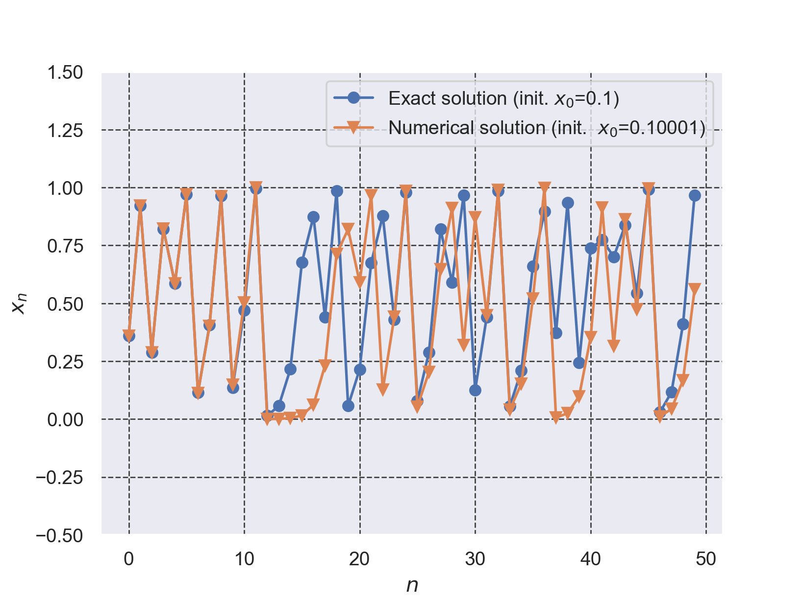
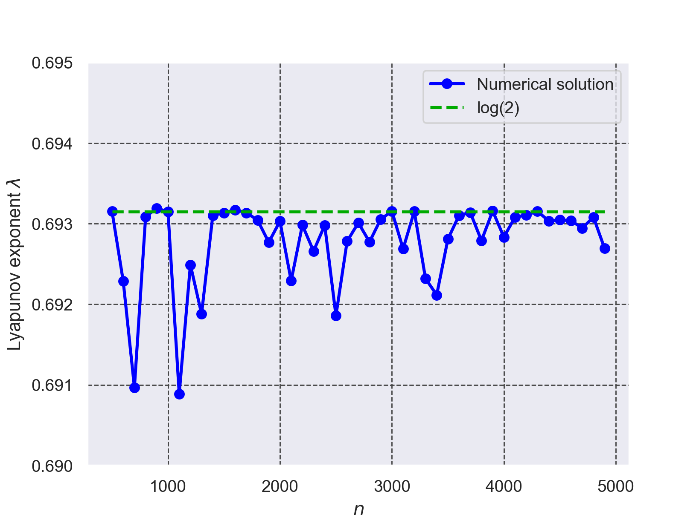
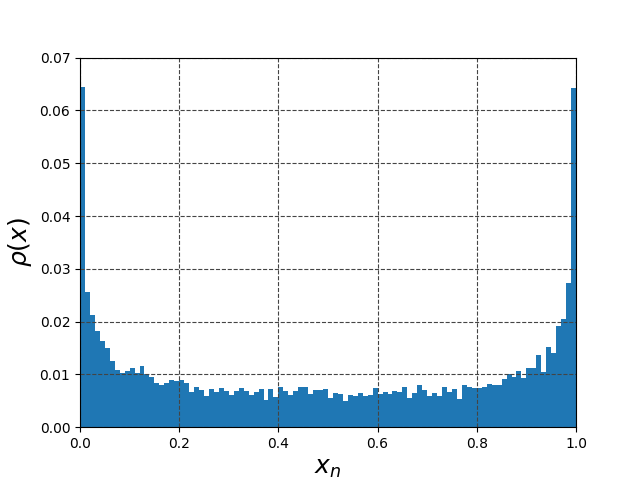

# カオス力学に関するまとめ

## Logistic 写像の初期値鋭敏性

+ Logistic 写像
```math
x_{n+1}=f(x_{n})=4x_{n}(1-x_{n}) \cdots (1)
```
の初期値鋭敏性を解析解
```math
x_{n}=\sin ^{2} \left(2^n \arcsin\left(\sqrt{x_{0}}\right) \right) \cdots (2)
```


の軌跡と数値計算による$`(1)`$の軌跡と比較して示す.
+ 解析解の初期値を$`𝑥_{0}=0.1`$，数値解析の初期値を$`𝑥_{0}=0.10001`$とした時の計算結
果を Fig. 1 に示す.
+ $`n \le 10`$では解析解と数値解はほぼ一致しているが，$`n>11`$になると解析解と数値解の挙動が異なっていることが確認できる。以上よりLogistic 写像の初期値鋭敏性が確認できた.
+ Fig. 1 のグラフの作成に使用したPythonプログラムは[./logistic_map.py](./logistic_map.py)である。


*Fig. 1 Logistic 写像の初期値鋭敏性*


## Logistic 写像の Lyapunov 指数 $`\lambda`$
+ Logistic 写像 $`(1)`$のLyapunov 指数 $`\lambda`$を$`(3)`$で定義する。
```math
\lambda = \lim_{T\to\infty} \frac{1}{T} \sum^{T-1}_{n=0}{\log\left| \frac{df({x_n})}{dx_n}\right| } = \lim_{T\to\infty} \frac{1}{T} \sum^{T-1}_{n=0}{\log\left| 4(1-2x_{n})\right| }\cdots (3)
```
+ $`T=500,600,…,5000`$と変化させて計算したLyapunov指数$`\lambda`$のグラフをFig. 2に
示す. 振動しながら$`\lambda`$が$`\log{2}`$に収束していく様子が確認できる.

+ Fig. 2 のグラフの作成に使用したPythonプログラムは[./lyapunov_plot.py](./lyapunov_plot.py)である。


*Fig. 2 Logistic 写像の Lyapunov 指数𝜆の収束過程*


## Logistic 写像の不変分布 $`\rho`$
+ Logistic 写像 $`(1)`$の不変分布 $`\rho(x)`$を$`(4)`$で定義する。
```math
\rho(x) = \lim_{T\to\infty} \frac{1}{T} \sum^{T-1}_{n=0}{\delta(x-x_n)  }\cdots (4)
```
+ $`\rho(x)`$を数値計算でもとめる。$`\rho(x)`$は適当な初期値$`x_0`$から$`x_{n+1}=f(x_{n})`$を$`n=10^6`$まで計算し、その値のヒストグラムを正規化することで求めた。
+ Fig. 3 のグラフの作成に使用したPythonプログラムは[./logistic_invariant_dist.py](./logistic_invariant_dist.py)である。



*Fig. 3 Logistic 写像の不変分布$`\rho(x)`$を数値計算で求めた結果*

- 参考文献[1] 中川 匡弘 (著), カオス・フラクタル感性情報工学 日刊工業新聞社，2010年


