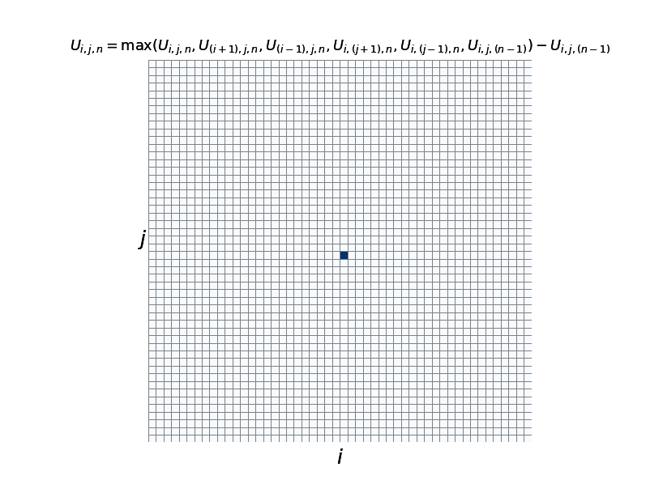
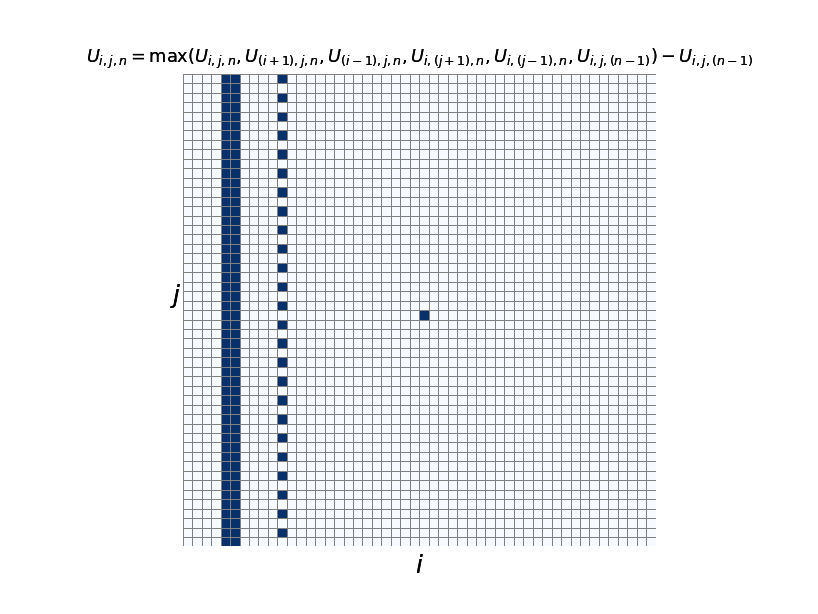
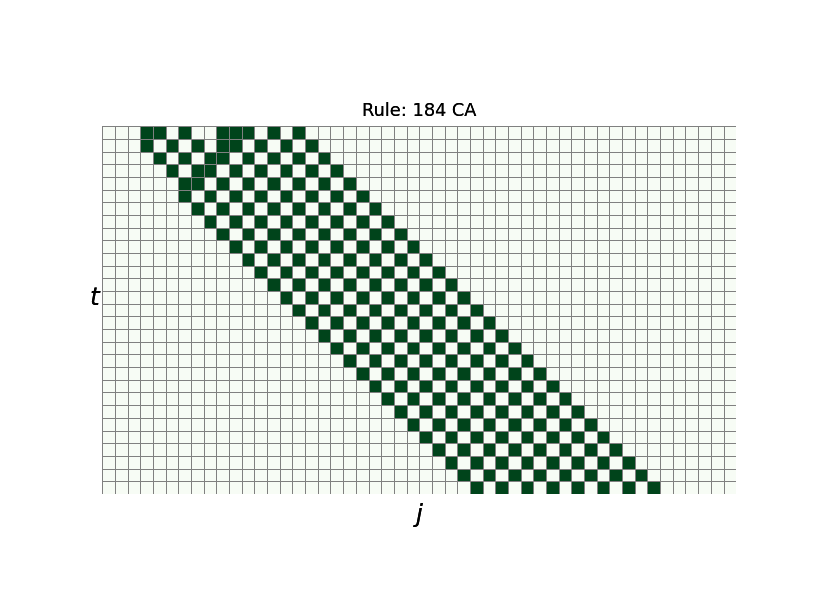
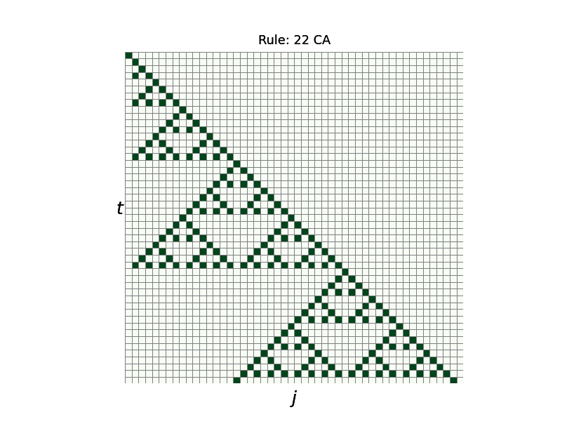
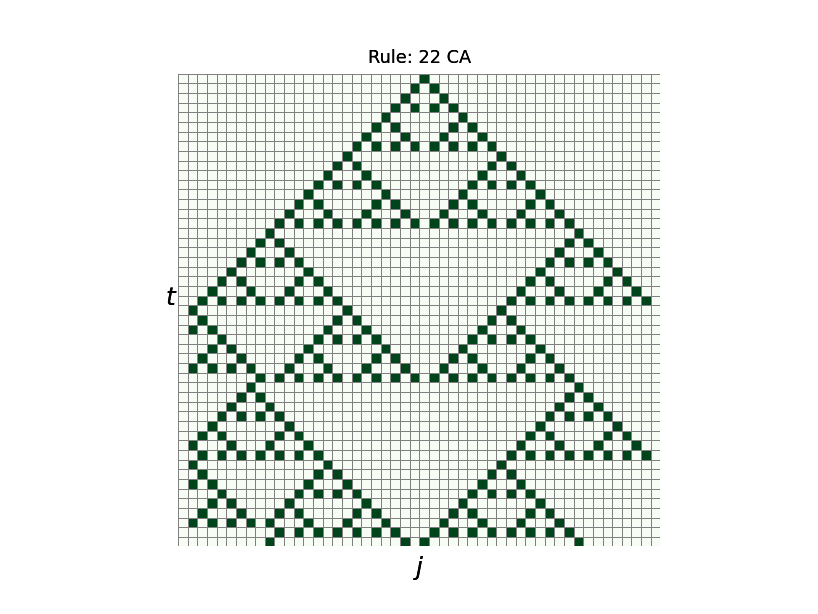

# 超離散化した拡散方程式
+ 超離散化した拡散方程式を以下に示す。
```math
U_{i,j,n}=\max({U_{i,j,n},U_{({i+1}),j,n}U_{({i-1}),j,n},U_{i,({j+1}),n},U_{i,({j-1}),n},U_{i,j,({n-1})}})-U_{i,j,({n-1})} \cdots (1)
```



* Fig. 1 $`U_{i,j,n}`$の$`n \ge 0`$に関するアニメーション。初期値は$` U_{25,25,0}=1, i\neq 25, j \neq 25 \Rightarrow U_{i,j,0}=0`$とした。*


* Fig. 2 $`U_{i,j,n}`$の$`n \ge 0`$は初期値が違うと全く異なるパターンが発生する*


* Fig. 3 ルール184のCAの時間発展の様子 *


* Fig. 4 ルール22のCAはシェルピンスキーのギャスケットになる *


* Fig. 5 ルール22のCAはシェルピンスキーのギャスケットになる(これも初期値によって出力された図形の形は変わる) *

- 参考文献[1]  差分と超離散 広田良吾・高橋大輔 共立出版 2003年
