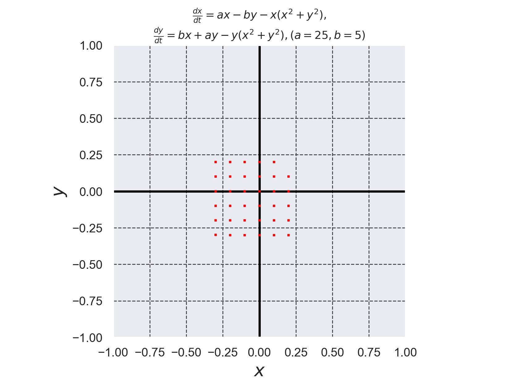

# 保存量を持つ微分方程式を4次のルンゲ・クッタ法でシュミレーションした結果

+ Sliding mode制御のシステムを$`(1)`$, $`(2)`$, $`(3)`$に示す。
+ 微分方程式を解く際に使用したルンゲ・クッタ法のコードは[./runge_kutta_sliding_mode.c](./runge_kutta_sliding_mode.c)である。 (このコードは参考文献[2]のコードを参考に実装した)。

```math
\frac{dx}{dt}=y \cdots (1)
```

```math
\frac{dy}{dt}2y-x+u(x,y) \cdots (2)
```

```math
u(x,y)=-\varphi(x,y) \cdots (3)
```

```math
\varphi(x,y) \cdots (4)
```



*Fig. 1 任意の初期値$`(x_0,y_0)`$から出発した解軌道が、$`t \to \infty`$で半径$`\sqrt{a}`$のリミットサイクルに収束していることが確認できる。また、$`(x,y)=(0,0)`$が不動点であることもわかる(しかし、$`(x,y)=(0,0)`$は不安定な不動点なので、わずかにでも0からずれるとリミットサイクルに収束する様子がアニメーションからも確認できる。)*


- 参考文献[1] スライディングモード制御 非線形ロバスト制御の設計理論 野波健蔵・田弘宏奇 コロナ社 2010年 初版第5刷発行, pp. 2-3
- 参考文献[2] C言語による数値計算入門 第2版 新装版 堀之内 總一・酒井幸吉・榎園茂 森北出版株式会社 2015年 第2版装版第1刷発行, pp.128-129

