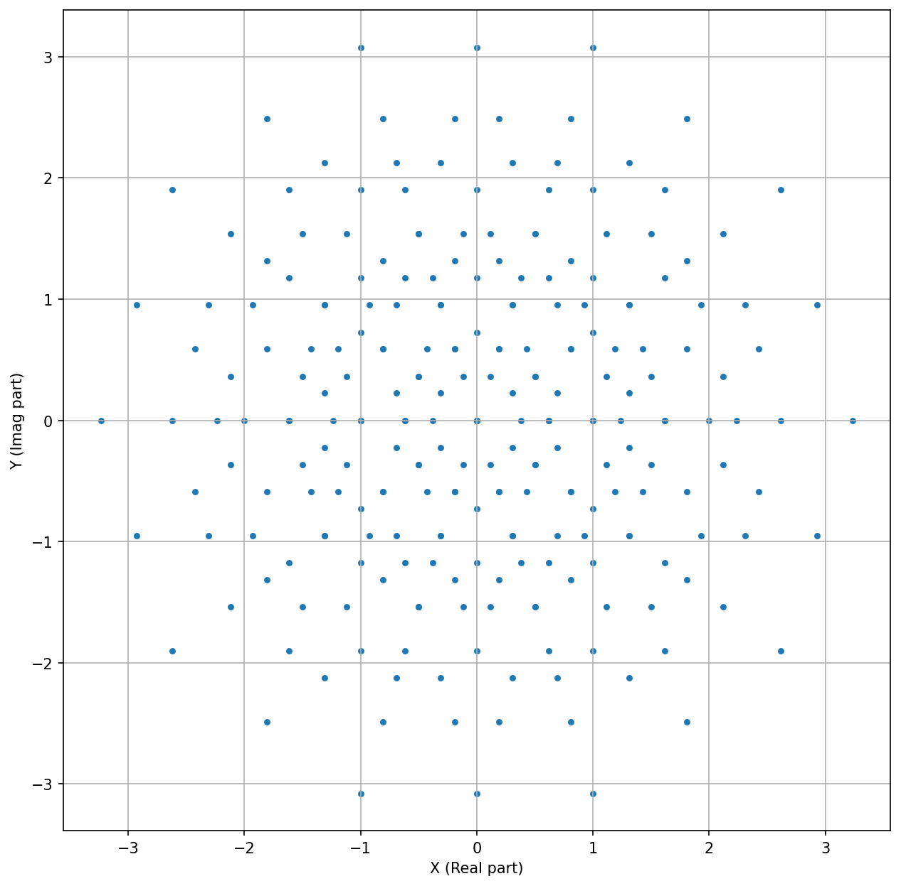
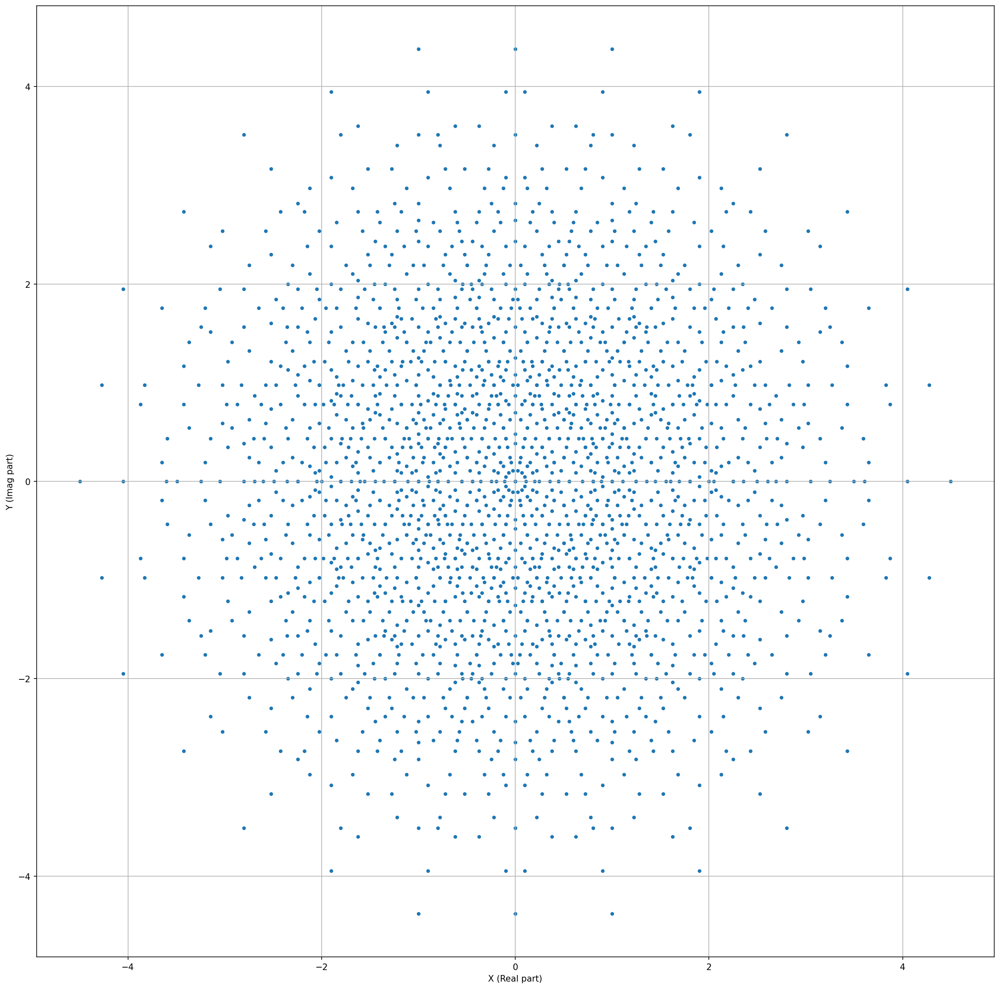

# cyclotomic_integers
- [./cyc_int_plot_for_jupyter.py](./cyc_int_plot_for_jupyter.py)素数`p`に対応する円分整数をjupyter上でプロットしたグラフを出力するプログラム

## NOTE
```math
L=\{-1,0,1\}, |L|=3
```
とするとき
```math
|L|^p
```
個のプロットしている。このため、`p=5,7`までは全点をプロットできたが、`p=9`は全点プロット(`3^9=19683`点)に時間がかかりすぎて作成をスキップした。

- `p=5`のときのプロット結果は
- `p=7`のときのプロット結果は


