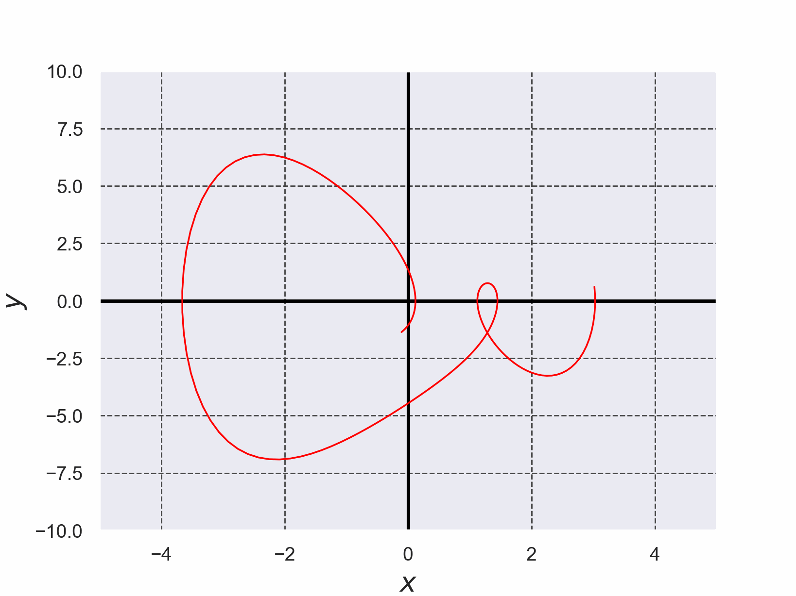
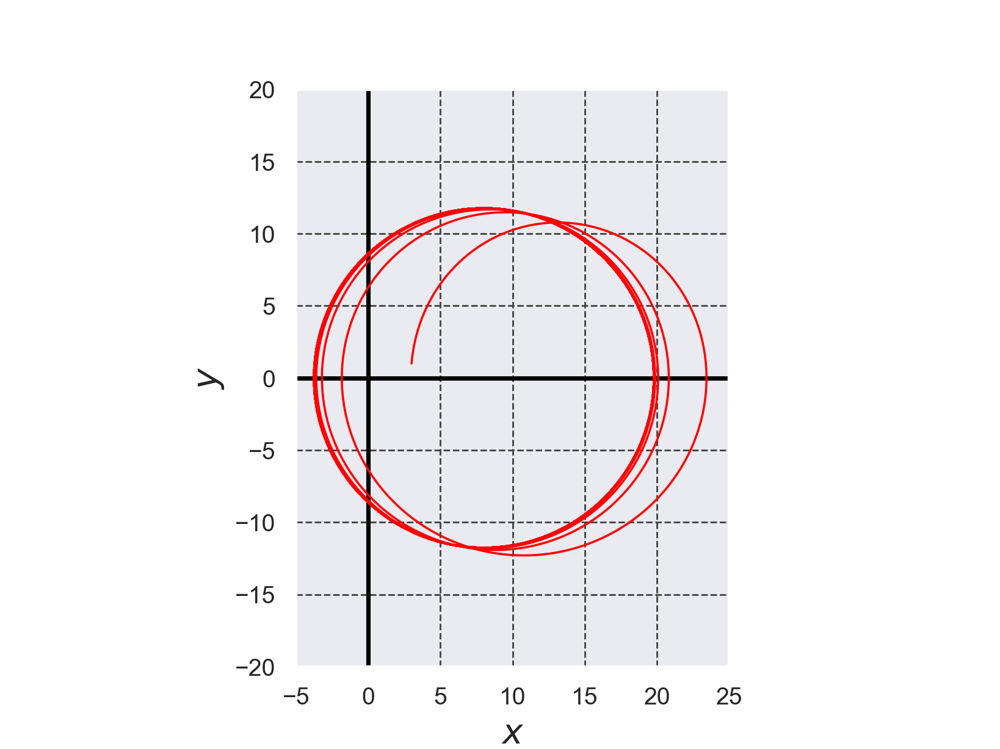
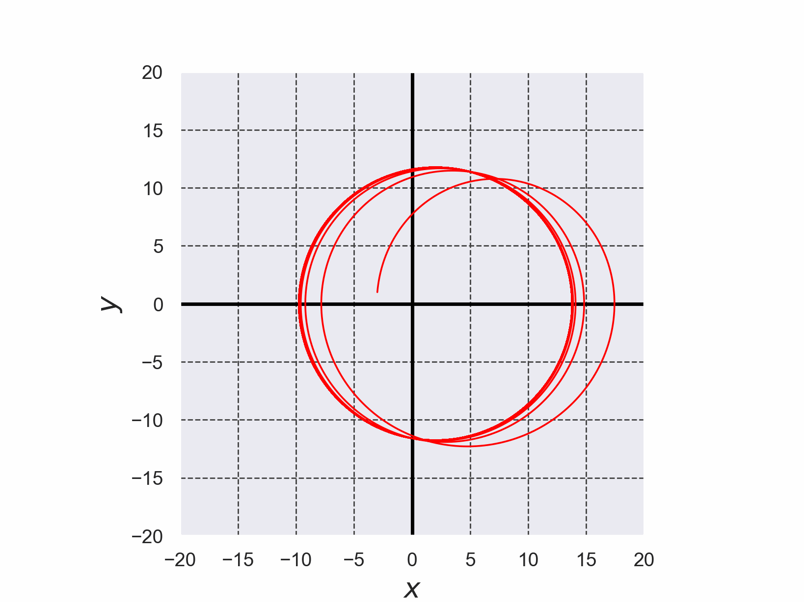
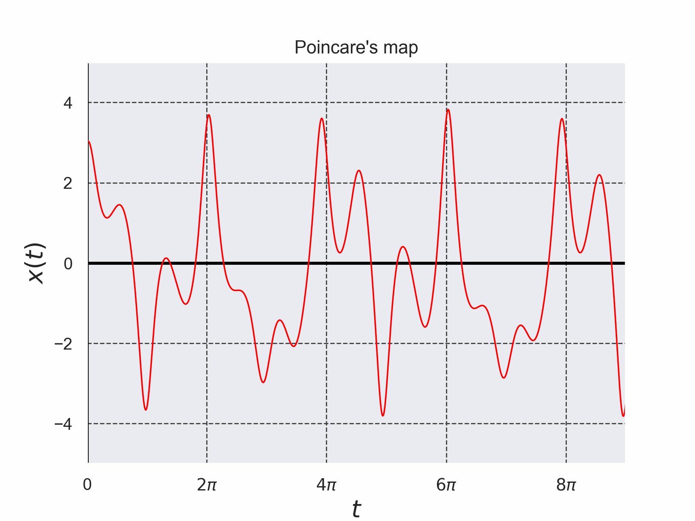
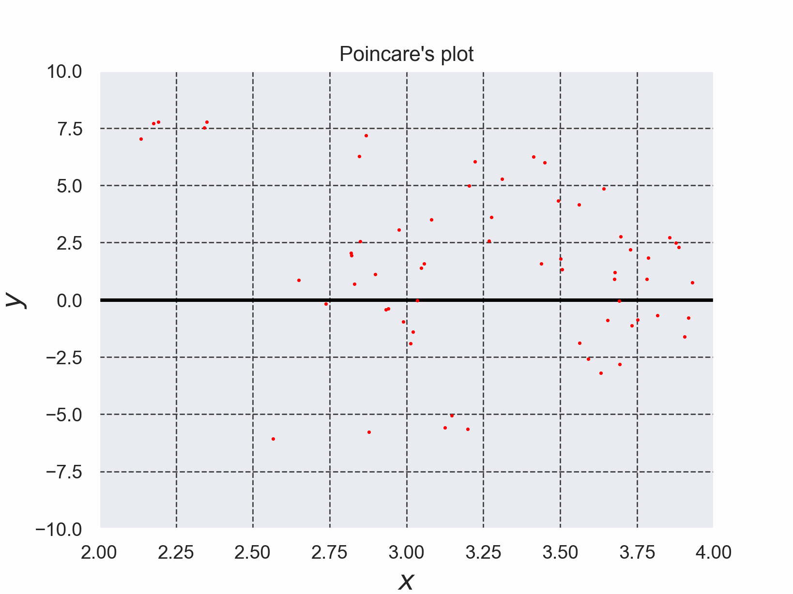

# Duffing方程式を4次のルンゲ・クッタ法で解いた結果

+ Duffing方程式を$`(1)`$,$`(2)`$で定義する。
+ 微分方程式を解く際に使用したルンゲ・クッタ法のコードは[./runge_kutta_duffing_eq.c](./runge_kutta_duffing_eq.c)である。 (このコードは参考文献[2]のコードを参考に実装した)。

```math
\frac{dx}{dt}=y \cdots (1)
```

```math
\frac{dy}{dt}=-ky-x^3+B\cos(t) \cdots (2)
```


*Fig. 1 Duffing方程式を4次のルンゲ・クッタ法で解いた結果*


*Fig. 2 Duffing方程式を4次のルンゲ・クッタ法で解いた結果のアニメーション*


*Fig. 3 非線形項$`-x^3`$を削除した時の結果*


*Fig. 4 非線形項$`-x^3`$を削除した時の結果 (初期値はFig. 3とは違う値にした、結果の差異が発生している理由はよくわからない。。。)*


*Fig. 5 Duffing方程式のポアンカレ写像 ($`t=2\pi`$に対応する$`x(t)`$の値がポアンカレ写像の値である)*


*Fig. 6 $`t=2\pi N, N \in \mathbb{N}`$に対応する$`(x(t),y(t))`$のプロット*

- 参考文献[1] 改定増補 カオス力学の基礎 早間 慧 現代数学社 2002年 改訂第2版, p. 5, pp. 129-131
- 参考文献[2] C言語による数値計算入門 第2版 新装版 堀之内 總一・酒井幸吉・榎園茂 森北出版株式会社 2015年 第2版装版第1刷発行, pp.128-129

