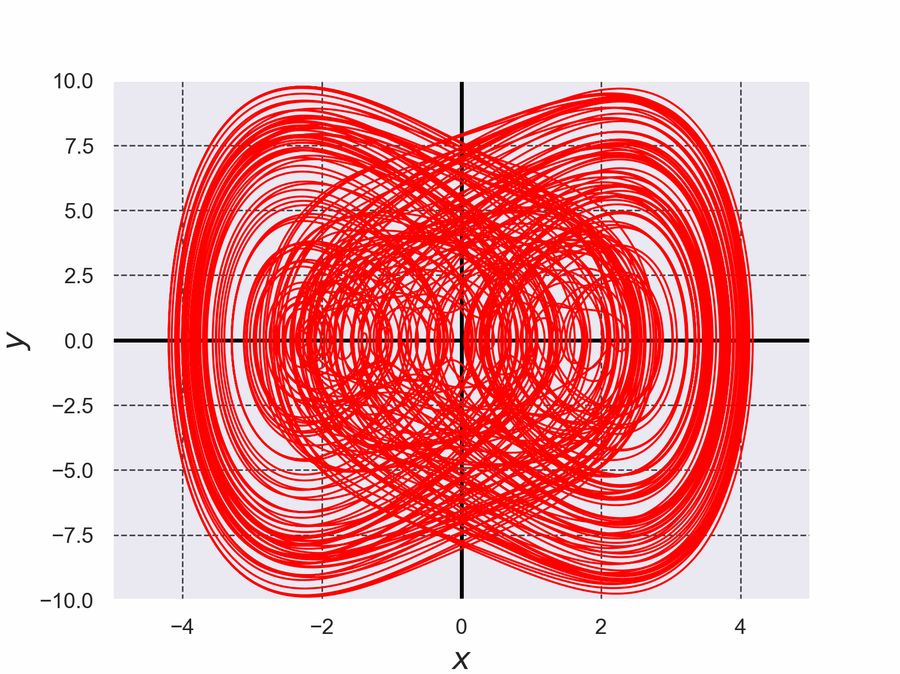

# Duffing方程式を4次のルンゲ・クッタ法で解いた結果

+ 微分方程式を解く際に使用したルンゲ・クッタ法のコードは[./runge_kutta_duffing_eq.c](./runge_kutta_duffing_eq.c)である。 (このコードは参考文献[2]のコードを参考に実装した)。

*Fig.1 Duffing方程式を4次のルンゲ・クッタ法で解いた結果*

- 参考文献[1] 改定増補 カオス力学の基礎 早間 慧 現代数学社 2002年 改訂第2版, p. 5, pp. 21-22
- 参考文献[2] C言語による数値計算入門 第2版 新装版 堀之内 總一・酒井幸吉・榎園茂 森北出版株式会社 2015年 第2版装版第1刷発行, pp.128-129

