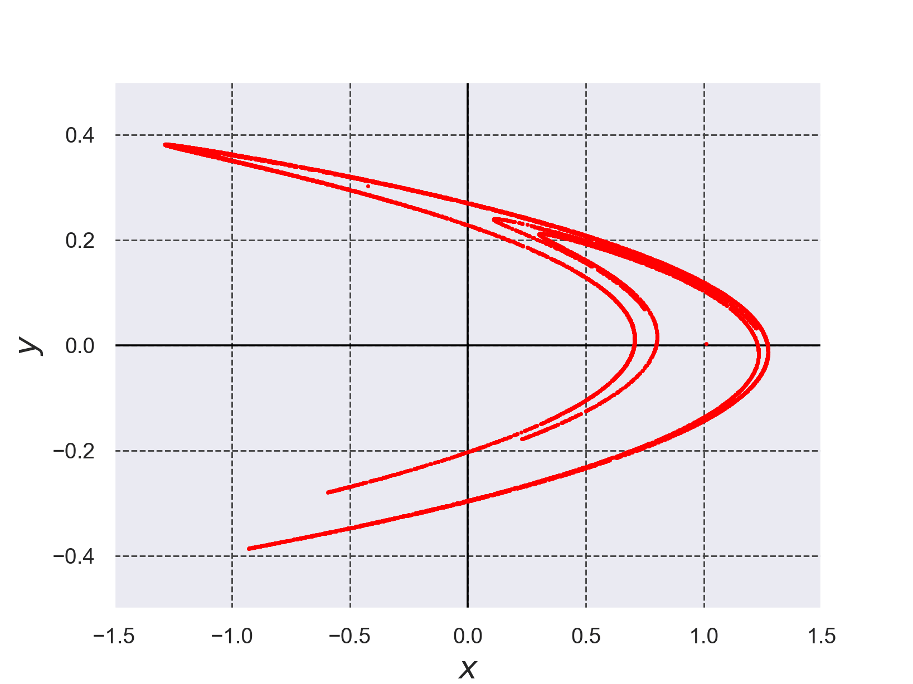
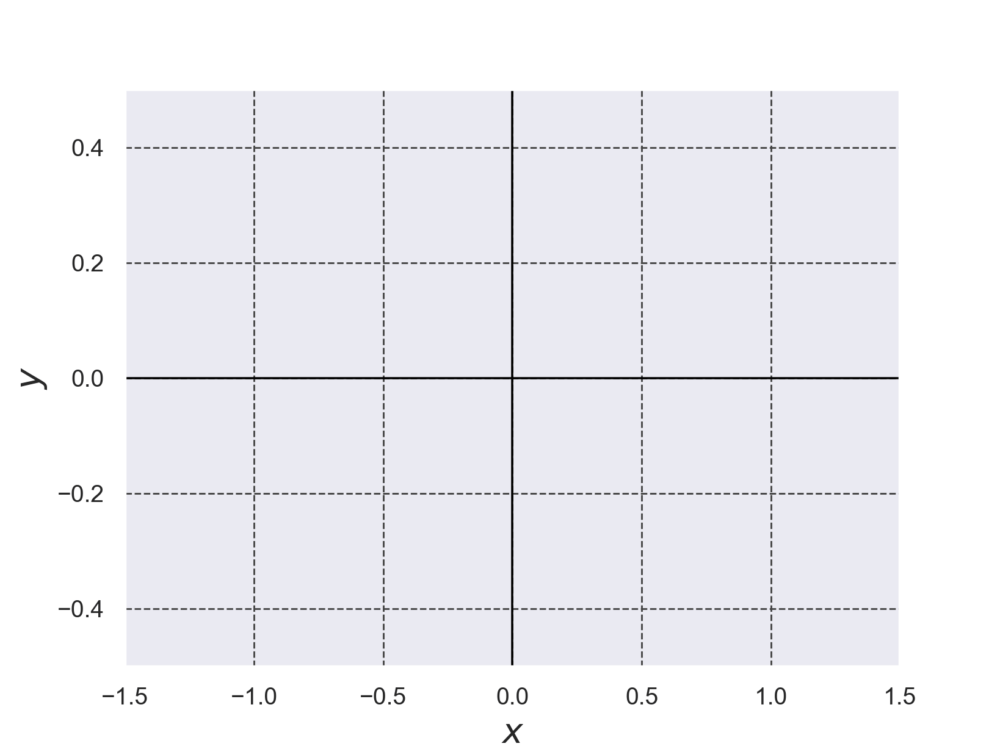
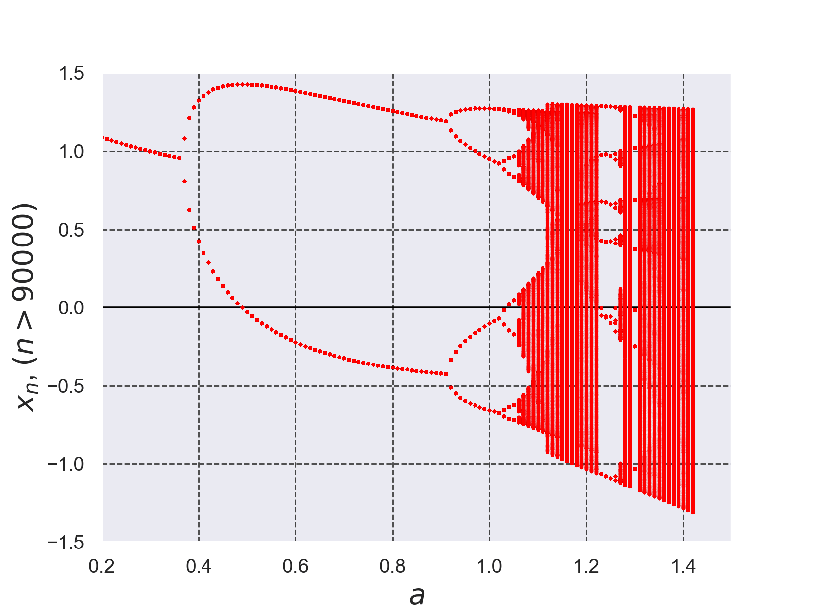

# エノン写像を繰り返し写像した結果のプロット
+ 下記で定義されるエノン写像を$`(a,b)=(1.4,0.3)`$、初期値$`x(0)=0.01, y(0)=0.01`$の条件で繰り返し写像しその結果をプロットした(エノン写像のパラメータ$`(a,b)=(1.4,0.3)`$は参考文献[1]の値を利用した)。

+ エノン写像を繰り返し写像した値を求めるコードは[./henon_map.c](./henon_map.c)である。
```math
x=y+1-ax^2\cdots (1)
```
```math
y=bx \cdots (2)
```


*Fig.1 エノン写像$`(a,b)=(1.4,0.3)`$を10000回写像した結果*

*Fig.2 エノン写像$`(a,b)=(1.4,0.3)`$を10000回写像した結果のアニメーション*

+ エノン写像のパラメータ$`a`$を変更した時の分岐図を以下に示す。

*Fig.3 エノン写像のパラメータ$`a`$を変更した時の分岐図 ($`b`$は0.3で固定)*


- 参考文献[1] 新版 基礎からの力学系 分岐解析からカオス的遍歴へ サイエンス社 2005年 新版第1刷発行, pp.123-124 (第9章 2次元写像のアトラクタ分岐)

