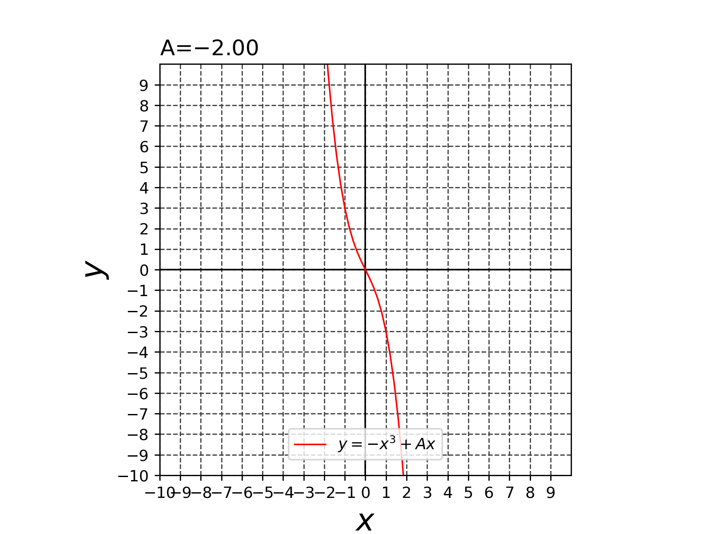
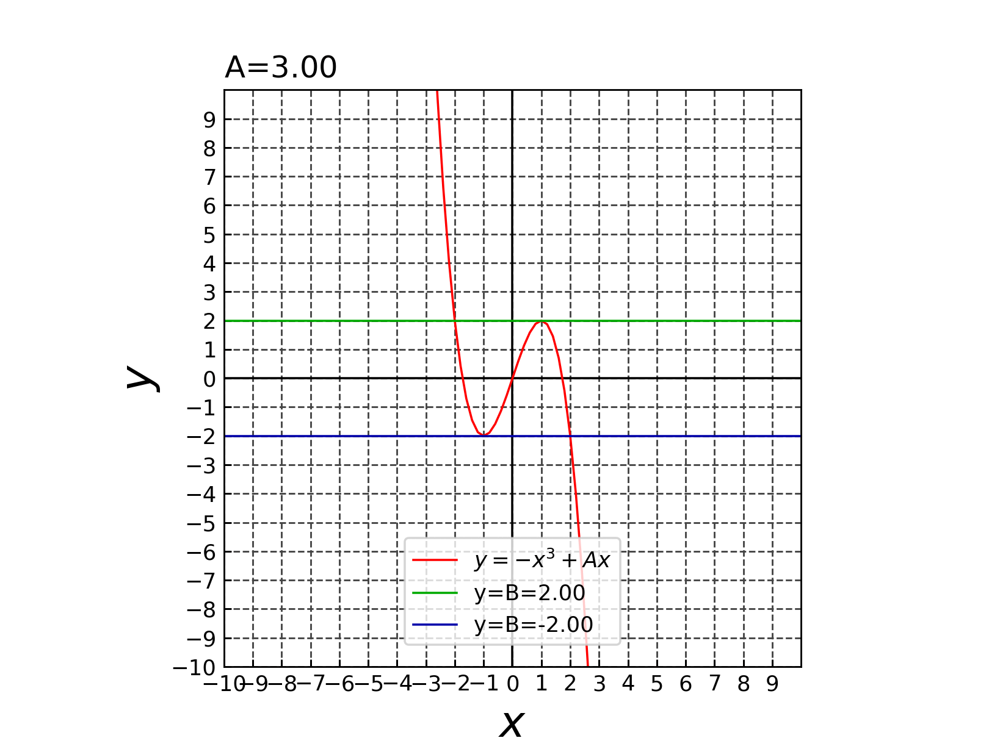
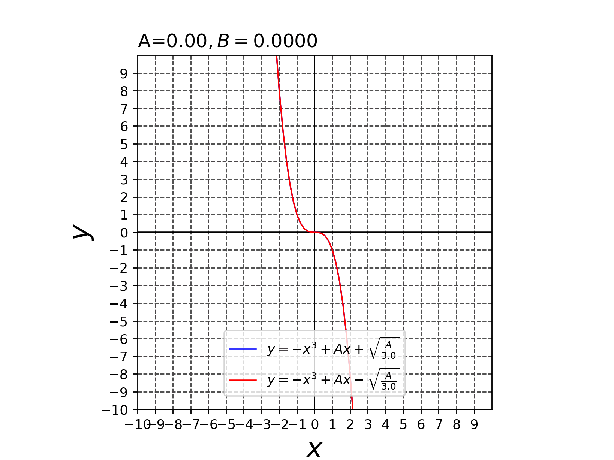
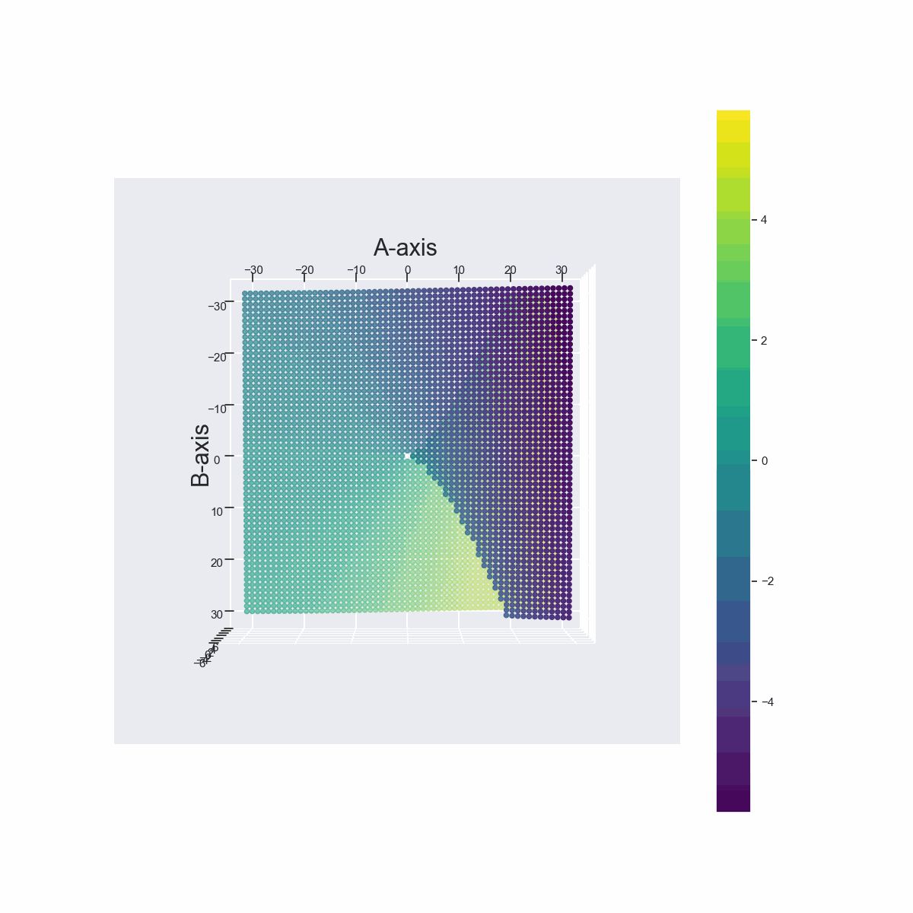
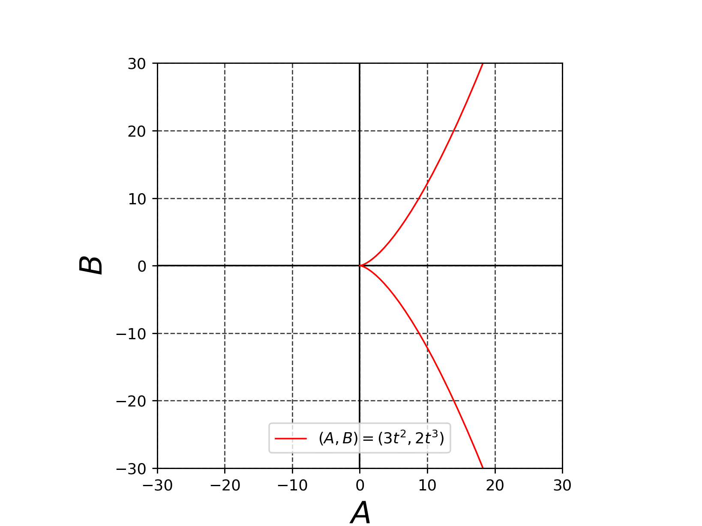

# 非線形微分方程式でカタストロフィとヒステリシスが発生する理由の説明


以下の実数パラメータ$`A , B`$をもつ1変数$`x`$に関する非線形微分方程式を考える。
```math
\frac{d x}{d t} = F(x,A,B)=-x^3 + Ax - B \cdots (1)
```
このとき、
```math
\frac{d x}{d t} = F(x,A,B)=-x^3 + Ax - B=0 \cdots (2)
```
を満たす$`x(t)=Const`$を微分方程式$`(1)`$の平衡点(不動点と呼ぶこともある)とよぶ。平衡点を$`x_e`$と表記する。
(平衡点はequilibrium pointなので、$`x_e`$という表記を採用した。)


さて、微分方程式$`(1)`$の平衡点$`x_e`$は$`-x^3 + Ax - B=0`$という３次方程式の実数解である。
この実数解の個数は$`A, B`$の値によって変わる。
> [!IMPORTANT]
> この個数は
> ```
> (3)と(4)の交点数が1になるA, Bの値のときは、実数解の個数=1になる。
> (3)と(4)の交点数が2になるA, Bの値のときは、実数解の個数=2になる。
> (3)と(4)の交点数が3になるA, Bの値のときは、実数解の個数=3になる。
> ```
>

```math
y=-x^3 + Ax \cdots (3)
```
```math
y=B \cdots (4)
```
(3)と(4)の交点数の変化について以下で説明する。
まず$`A<0`$のときの$`y=-x^3 + Ax`$のグラフの例を以下に示す。


*Fig.1 $`y=-x^3 -2x`$のプロット ($`x`$に関して単調減少なグラフなので任意の実数$`B`$に対して$`y=B`$と唯一の解をもつ)*


*Fig.2 $`y=-x^3`$のプロット ($`x`$に関して単調減少なグラフなので任意の実数$`B`$に対して$`y=B`$と唯一の解をもつ)*


*Fig.3 $`y=-x^3+3x`$のプロット ($`y=-x^3+3x`$のグラフには極大値と極小値が存在している。このため$`|B|=2`$のとき$`y=B`$と2個の実数解をもつ、このため$`|B|<2`$のときは$`y=B`$と3個の実数解をもつ)*


*Fig.4 $`y=B=\sqrt{\frac{A}{3}}, A>0`$のときに$`y=-x^3 + Ax`$と２点で接することがわかるアニメーション*


*Fig.5 $`y=-x^3 + Ax \pm \sqrt{\frac{A}{3}}`$のときのグラフ ($`-x^3 + Ax \pm \sqrt{\frac{A}{3}}=0`$の解は２重解が1つ、１重解が1つであることがわかる)*


> [!IMPORTANT]
> この実数解の個数は$`A, B`$の値によって異なる3個の解の場合と1個の解のときがある。
> これは以下の3Dグラフを見ると理解できる。


*Fig.6 $`-30 \le A,B \le 30`$の範囲の３次方程式$`-x^3 + Ax - B=0`$の実数解の3Dプロット(その1)*

*Fig.7 $`-30 \le A,B \le 30`$の範囲の３次方程式$`-x^3 + Ax - B=0`$の実数解の3Dプロット(その2)*

ところで、以下のグラフを見るとわかるように、実数解の個数は$`A, B`$の値によって平面上のある領域では異なる3個の解になるがそれ以外では1個の解のときがあることが確認できる。

```math
|B| \le \frac{2A \sqrt{A}}{\sqrt{3}}の範囲で実数解の個数が3、それ以外の場合は実数解の個数は1 \cdots (5)
```



*Fig.8 $`-30 \le A,B \le 30`$の範囲の３次方程式$`-x^3 + Ax - B=0`$の実数解の3Dプロット(その3), $`|B| \le \frac{2A \sqrt{A}}{\sqrt{3}}`$の範囲で実数解の個数が3,それ以外では1となっていることが確認できる。*

$`A,B`$平面上で3個の解の実数解を持つ領域と1個実数解を持つ領域の境界の曲線はカスプと呼ばれる。この曲線は以下で求めることができる。

```math
-x^3 + Ax - B=0 \cdots (6)
```
```math
-3x^2 + A =0 \cdots (7)
```
```math
A=3x^2 \cdots (8)
```

$`(8)`$を$`(6)`$に代入すると

```math
-x^3 + Ax - B = -x^3 + (3x^2)x - B = 2x^3 - B = 0 \cdot (9)
```
```math
\therefore \left( A,B \right) = (3x^2, 2x^3),  \left( -\infty <  x < \infty \right) \cdots (10)
```

*Fig.9 カスプ$`\left( A,B \right) = (3x^2, 2x^3), \left( -\infty <  x < \infty \right)`$のプロット*


*Fig.4 ３次方程式$`-x^3 + Ax - B=0`$の実数解$`x_e{(A,B)}=-3{x_e}^2 + A`$(平衡点)の3Dプロット(その1)*


*Fig.5 ３次方程式$`-x^3 + Ax - B=0`$の実数解$`x_e`$(平衡点)を$`\frac{d F}{d x}(x_e)=-3{x_e}^2 + A `$の3Dプロット(その2)*


<!-- \therefore \left( A,B \right) = (3x^2, 2x^3),  \left( x \in \mathbb{R} \right) \cdots (7) -->

<!-- ```math
-x^3 + Ax - B=0 \cdots (3) \\
-3x^2 + A =0 \cdots (4) \\
A=3x^2 \cdots (5) \\

(5)を(3)に代入すると
-x^3 + Ax - B = -x^3 + (3x^2)*x - B = -x^3 ^ 3x^3 - B = 2x^3 = B \cdots (6) \\

\therefore \left( A,B \right) = (3x^2, 2x^3),  \left( x \in \mathbb{R} \right) \cdots (7)

``` -->
$`(7)`$の曲線はカスプ(cusp)と呼ばれる。$`(7)`$の曲線は以下である。


<!-- *Fig.1 カスプ\left( A,B \right) = (3x^2, 2x^3),  \left( x \in \mathbb{R} \right)のプロット* -->


$`(1)`$を$`x`$で偏微分した結果は以下のようになる。

```math
\frac{\partial^2 x}{\partial x\partial t}(x) = \frac{d F}{d x}(x)=-3x^2 + A \cdots (3)
```
$`(3)`$を$`f(x)`$とおく。

このとき、$`\lvert x(t) - x_e \rvert \simeq 0`$のとき$`(1)`$に関して以下が成立する。
```math
\frac{d x}{d t} = f(x_e)(x-x_e) \cdots (4)
```
これは微分方程式$`(1)`$を平衡点$`x_e`$の近傍で線形近似した結果である。
このため、$`(4)`$の解は求めることが可能で
```math
x(t) = \exp \left( f(x_e)t \right) + x_e \cdots (5)
```
となる。

$`f(x_e)<0`$ならば、$`x_e`$は安定な平衡点と呼ぶ。<br>
$`f(x_e)>0`$ならば、$`x_e`$は不安定な平衡点と呼ぶ。<br>


$`x_e`$が安定な平衡点であるときに
微分方程式$`(1)`$を$`\lvert x(0) - x_e \rvert \simeq 0`$をみたす初期値$`x(0)`$でルンゲ・クッタ法などで変数$`t`$に関して数値積分すると
```math
\lim_{t\to\infty} x(t) = x_e
```
という結果になる。なぜならば$`f(x_e)<0`$なので
```math
\lim_{t\to\infty} \exp \left( f(x_e)t \right) = 0\cdots (6)
```
となるからである。もし$`x_e`$が不安定な平衡点であるときは初期値$`x(0)`$が$`x(0) \neq x_e`$である限りルンゲ・クッタ法などで変数$`t`$に関して数値積分すると
```math
\lim_{t\to\infty} x(t) = \infty\cdots (7)
```

という結果になる。なぜならば$`f(x_e)>0`$なので
```math
\lim_{t\to\infty} \exp \left( f(x_e)t \right) = \infty\cdots (8)
```


```math
-3x^2 + A = 0 \Leftrightarrow x = \pm \sqrt {\frac{A}{3}} \cdots (3)
```

```math
G(x)=-x^3 + Ax \cdots (4)
```
とするとき


$`(5)`$の不等式を満たす$`A , B`$で解の個数は3個になる。
```math
A > 0 \wedge \left| -\left(\sqrt{\frac{A}{3}}\right)^3 + A\sqrt{\frac{A}{3}} \right| < B \cdots (5)
```

$`(6)`$の不等式を満たす$`A, B`$で解の個数は1個になる。

```math
A \le 0 \vee \left| -\left(\sqrt{\frac{A}{3}}\right)^3 + A\sqrt{\frac{A}{3}} \right| \ge B \cdots (6)
```

<!--

まず、$`F(x)`$を$`x`$で微分したときに$`0`$になる点を求める。
```math
\frac{\partial^2 x}{\partial x\partial t} = \frac{d F}{d x}=-3x^2 + A =0
```
より
```math
\therefore x = \pm\frac{\sqrt{A}} {3}
```
となる。以下のアニメーションからわかるように$`A \neq 0`$であれば
```math
F(x)=-x^3 + Ax - B = 0
```
を満たす点 (つまり$`F(x)`$の零点)が3個出現することがわかる。
$`A = 0`$であれば$`F(x)`$の零点は$`x=0`$のみである。


ここで、
```math
\frac{d x}{d t} =F(x)= -x^3 + Ax - B = 0
```
を満たす変数$`t`$に関する定数関数$` x = h `$を求める。

つまり、
```math
\frac{\partial^2 x}{\partial x\partial t} = \frac{d F}{d x}=-3x^2 + A =0
```
```math
\therefore x = \pm\frac{\sqrt{A}} {3}
```


を満たす定数関数$`h(A,B)`$は微分方程式 $`(1)`$の不動点である。
不動点には安定性という概念が存在する。

ところで、$`F(x)=x^3 - Ax - B`$は3次関数なので$`\frac{d F}{d x}=0`$となる点$`x`$ (極大値 or 極小値)が不動点である。
ゆえに

```math
\frac{d F}{d x}=3x^2 - A =0
```
```math
\therefore x = \pm\frac{\sqrt{A}} {3}
```


```math
F(\frac{\sqrt{A}} {3})= {\frac{\sqrt{A}} {3}}^3 - A\frac{\sqrt{A}} {3} - B = 0

``` -->