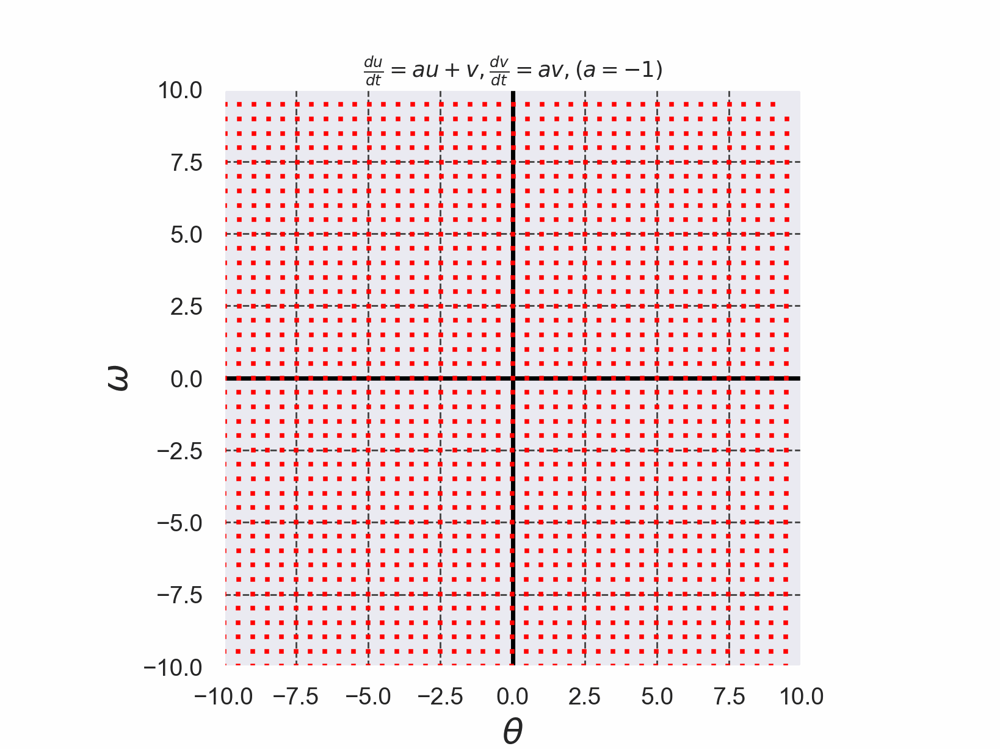
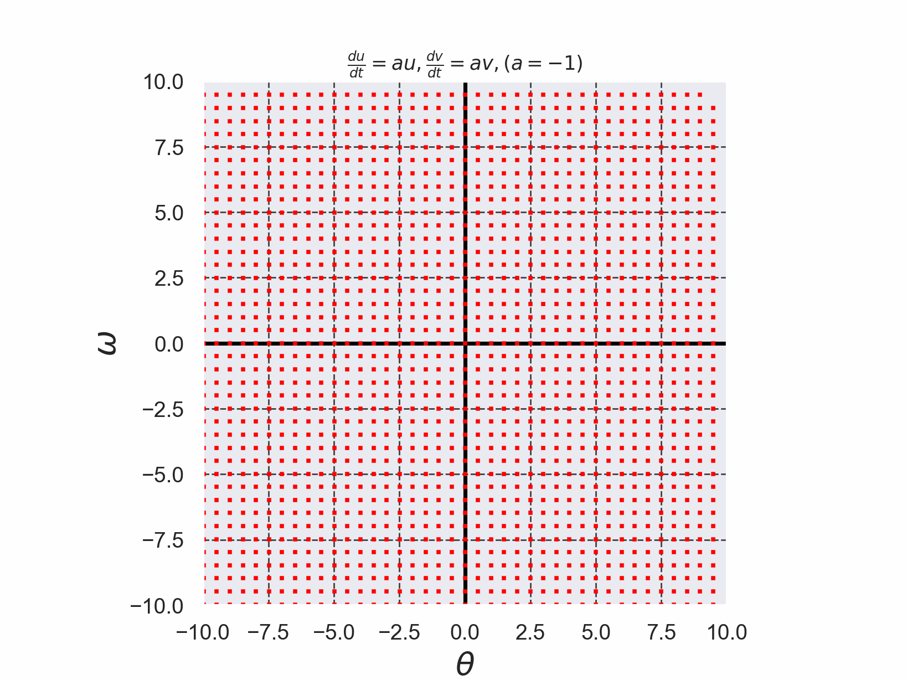

# 重複固有値のある線形ベクトル場を4次のルンゲ・クッタ法で解いた結果

+ 重複固有値のある線形ベクトル場を$`(1)`$,$`(2)`$で定義する。
+ 微分方程式を解く際に使用したルンゲ・クッタ法のコードは[./runge_kutta_jordan_flow.c](./runge_kutta_jordan_flow.c)である。 (このコードは参考文献[2]のコードを参考に実装した)。

```math
\frac{du}{dt}=au+v \cdots (1)
```

```math
\frac{dv}{dt}=av \cdots (2)
```


*Fig. 1 重複固有値をもつ線形ベクトル場を4次のルンゲ・クッタ法で解いた結果のアニメーション*

+ 別の重複固有値のある線形ベクトル場を$`(3)`$,$`(4)`$で定義する。
```math
\frac{du}{dt}=au \cdots (3)
```

```math
\frac{dv}{dt}=av \cdots (4)
```


*Fig. 1 重複固有値をもつ線形ベクトル場を4次のルンゲ・クッタ法で解いた結果のアニメーション*

- 参考文献[1] 新版 基礎からの力学系 分岐解析からカオス的遍歴へ サイエンス社 2005年 新版第1刷発行, pp. 57-59
- 参考文献[2] C言語による数値計算入門 第2版 新装版 堀之内 總一・酒井幸吉・榎園茂 森北出版株式会社 2015年 第2版装版第1刷発行, pp.128-129

