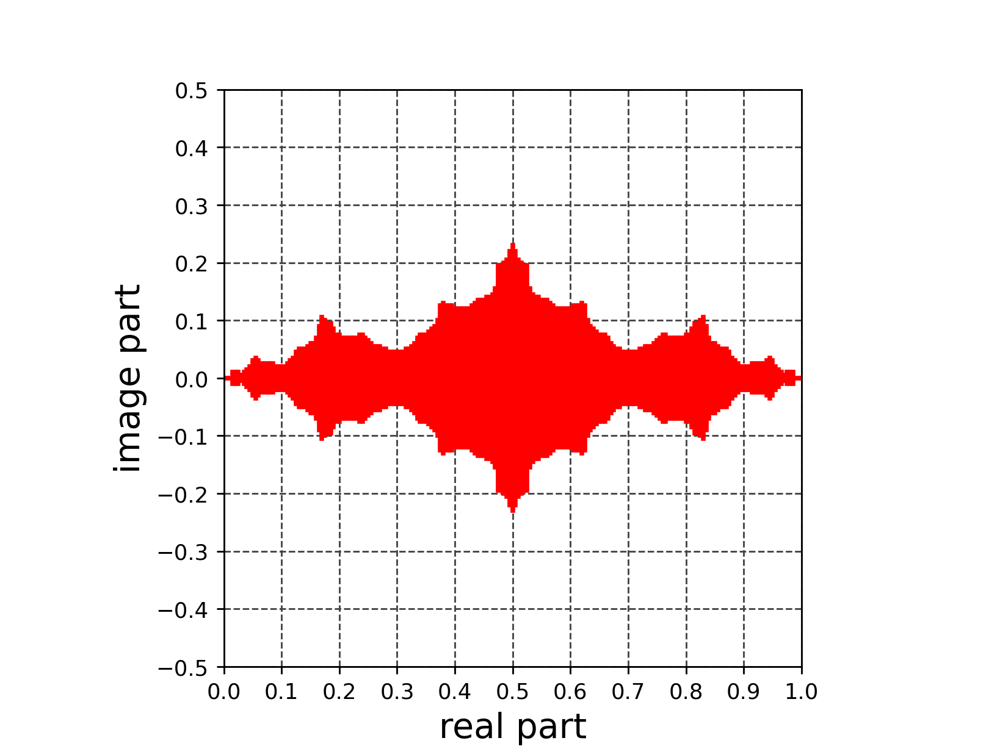
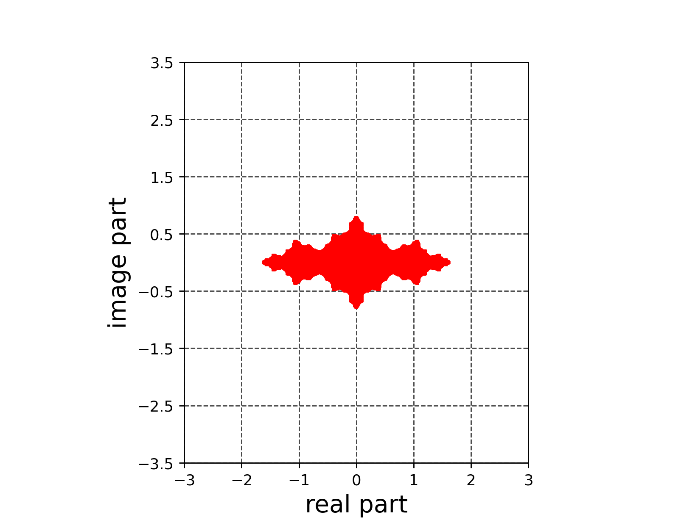

# 写像によるフラクタル(ジュリア集合、複素数のロジスティクス写像)
複素平面から複素平面への写像
```math
z_{n+1}=f(z_n)
```
を考えたとき$`n\to \infty`$において$`|z_n| \to \infty`$にならない初期値$`z_0`$の集合をジュリア集合と呼ぶ (参考文献[1])。






- 参考文献[1] フラクタル 新装版 高安秀樹 朝倉書店 2010年 新装版第1刷, pp.86-87

