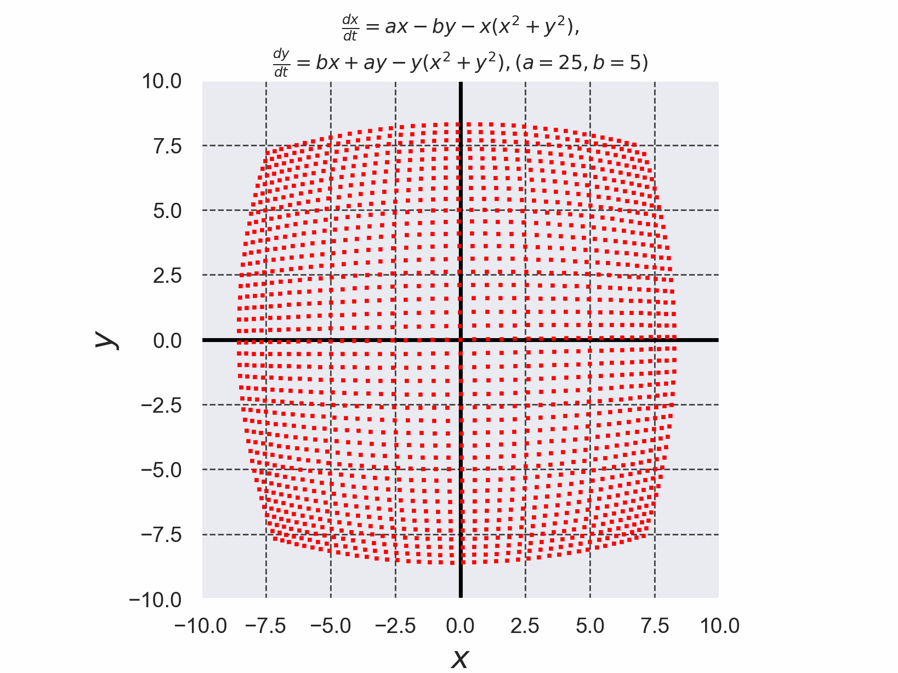

# リミットサイクルをもつ微分方程式を4次のルンゲ・クッタ法で解いた結果

+ $`(1)`$,$`(2)`$で定義された連立微分方程式はリミットサイクルをもつ。
+ 微分方程式を解く際に使用したルンゲ・クッタ法のコードは[./runge_kutta_limit_cycle.c](./runge_kutta_limit_cycle.c)である。 (このコードは参考文献[2]のコードを参考に実装した)。

```math
\frac{dx}{dt}=a x- b y -x(x^2+y^2) \cdots (1)
```

```math
\frac{dy}{dt}=b x + a y -y (x^2+y^2) \cdots (2)
```


*Fig. 1 任意の初期値$`(x_0,y_0)`$から出発した解軌道が、$`t \to \infty`$で半径$`\sqrt{a}`$のリミットサイクルに収束していることが確認できる。また、$`(x,y)=(0,0)`$が不動点であることもわかる(しかし、$`(x,y)=(0,0)`$は不安定な不動点なので、わずかにでも0からずれるとリミットサイクルに収束する様子がアニメーションからも確認できる。)*


- 参考文献[1] 新版 基礎からの力学系 分岐解析からカオス的遍歴へ サイエンス社 2005年 新版第1刷発行, pp. 88-89
- 参考文献[2] C言語による数値計算入門 第2版 新装版 堀之内 總一・酒井幸吉・榎園茂 森北出版株式会社 2015年 第2版装版第1刷発行, pp.128-129

