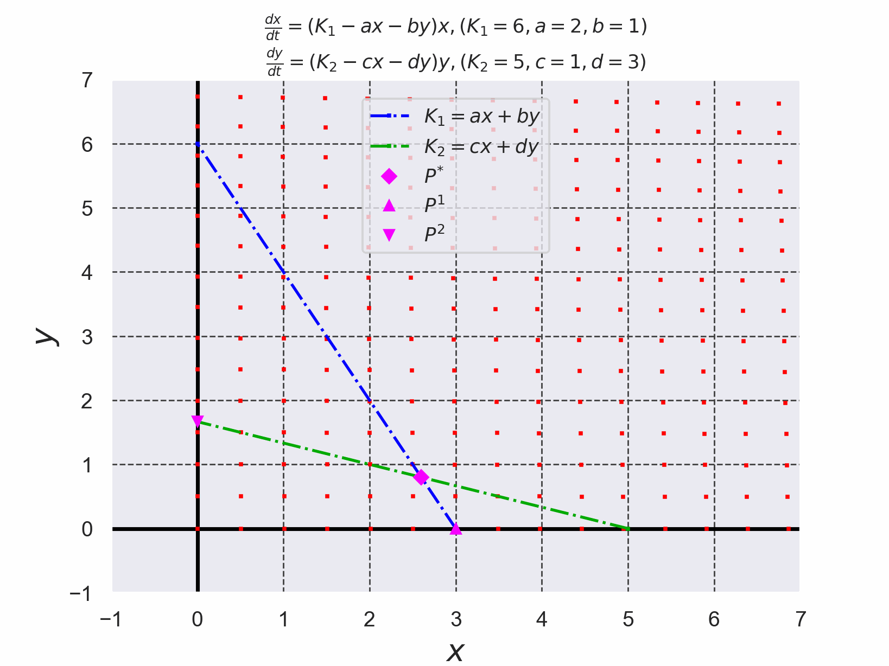
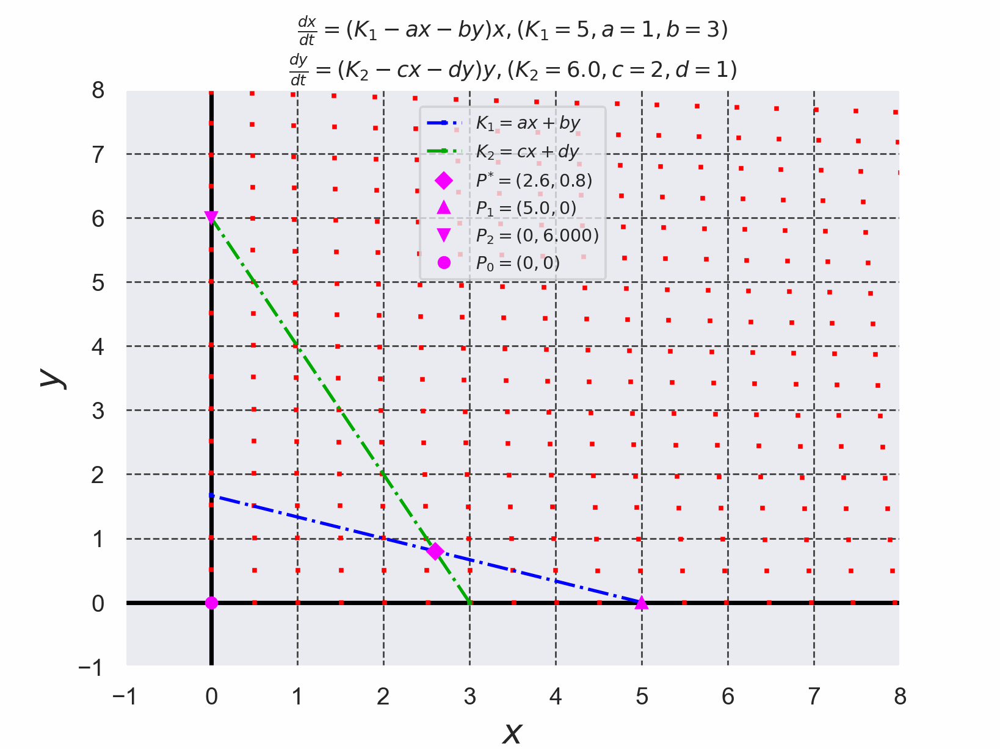
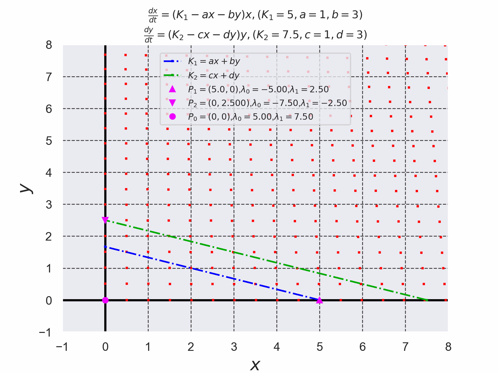
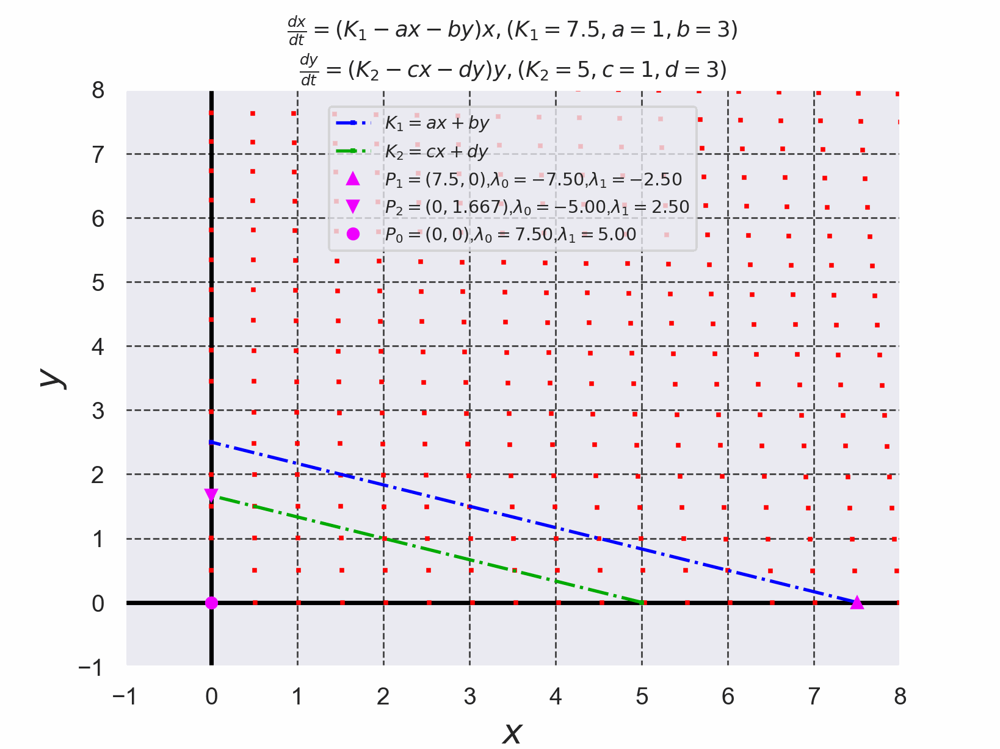

# Lotka-Volterraの競争モデルを4次のルンゲ・クッタ法で解いた結果

+ Lotka-Volterraの競争モデルを$`(1)`$,$`(2)`$で定義する。
+ 微分方程式を解く際に使用したルンゲ・クッタ法のコードは[./runge_kutta_lotka_volterra_eq.c](./runge_kutta_lotka_volterra_eq.c)である。 (このコードは参考文献[2]のコードを参考に実装した)。

```math
\frac{dx}{dt}=(K_1-ax-by)x \cdots (1)
```

```math
\frac{dy}{dt}=-(K_2-cx-dy)y \cdots (2)
```


*Fig. 1 安定な平衡点$`P^*`$をもつ場合のLotka-Volterraの競争モデルのアニメーション*


*Fig. 2 平衡点$`P^*`$が不安定な場合のLotka-Volterraの競争モデルのアニメーション*


*Fig. 3 平衡点$`P^*`$が存在しないLotka-Volterraの競争モデルのアニメーション($`P_1`$に収束していることがわかる)*


*Fig. 4 平衡点$`P^*`$が存在しないLotka-Volterraの競争モデルのアニメーション($`P_2`$に収束していることがわかる)*


- 参考文献[1] 常微分方程式 基礎から応用へ 新装版 俣野博 岩波書店 2026年 新装版第1刷発行, pp. 110-112
- 参考文献[2] C言語による数値計算入門 第2版 新装版 堀之内 總一・酒井幸吉・榎園茂 森北出版株式会社 2015年 第2版装版第1刷発行, pp.128-129
- 参考文献[3] 改定増補 カオス力学の基礎 早間 慧 現代数学社 2002年 改訂第2版, pp. 66-67
- 参考文献[4] 岩波講座 応用数学20 [対象8] 生命・生物科学の数理 甘利俊一・重定南々子・石井一成・太鼓地武・弓場美裕 岩波書店 1998年 第2版発行, pp. 6-9
