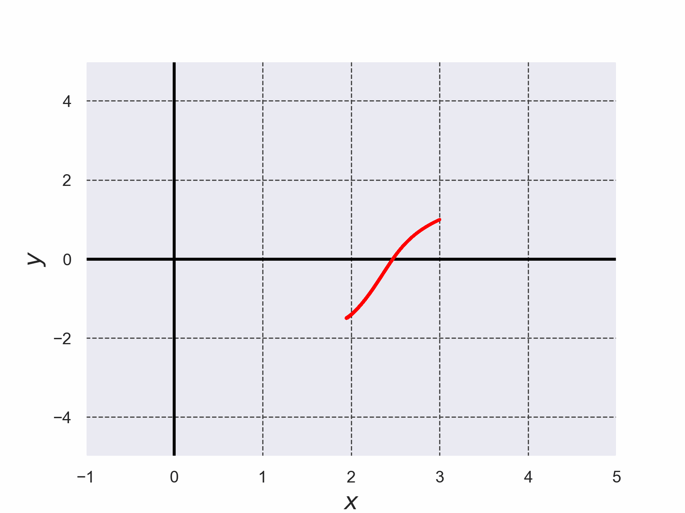

# Nagumo方程式を4次のルンゲ・クッタ法で解いた結果

+ Nagumo方程式を$`(1)`$,$`(2)`$で定義する。
+ 微分方程式を解く際に使用したルンゲ・クッタ法のコードは[./runge_kutta_lotka_volterra_eq.c](./runge_kutta_lotka_volterra_eq.c)である。 (このコードは参考文献[2]のコードを参考に実装した)。

```math
\frac{dx}{dt}=(a-cy)x \cdots (1)
```

```math
\frac{dy}{dt}=-(b-dx)y \cdots (2)
```



*Fig. 1 Lotka-Volterra方程式を4次のルンゲ・クッタ法で解いた結果*


*Fig. 2 Lotka-Volterra方程式を4次のルンゲ・クッタ法で解いた結果のアニメーション*

- 参考文献[1] 常微分方程式 基礎から応用へ 新装版 俣野博 岩波書店 2026年 新装版第1刷発行, pp. 110-112
- 参考文献[2] C言語による数値計算入門 第2版 新装版 堀之内 總一・酒井幸吉・榎園茂 森北出版株式会社 2015年 第2版装版第1刷発行, pp.128-129
- 参考文献[3] 改定増補 カオス力学の基礎 早間 慧 現代数学社 2002年 改訂第2版, pp. 66-67
