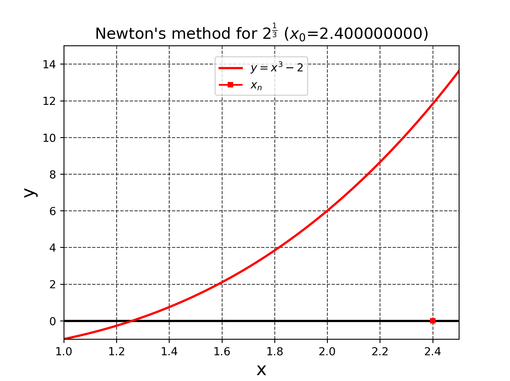

# ニュートン法で2の立方根の近似値を求める

```math
y=f(x)=x^3-2 \cdots (1)
```
```math
f^{\prime}(x)=\frac{df(x)}{dx}=3x^2 \cdots (2)
```

とする時、適当な初期値$`x_0`$を与えて
```math
x_{n+1}=x_n - \frac{f(x_n)}{f^{\prime}(x_n)} \cdots (3)
```
という漸化式を計算すると
```math
\lim_{n\to\infty} x_{n}=2^{\frac{1}{3}} \cdots (4)
```
となり2の立方根$`2^{\frac{1}{3}}=1.25992104989...`$が求まる。$`(3)`$の計算法をニュートン法と呼ぶ。ニュートン法のアニメーションをFig. 1に示す。



*Fig. 1 $`2^{\frac{1}{3}}`$をニュートン法で求めるアニメーション*

Fig. 1は[./newtons_method.py](./newtons_method.py)のコードで作成した。

- 参考文献[1] 方程式と対称性 山下純一 現代数学社 2021年 初版 ,pp. 99-101


