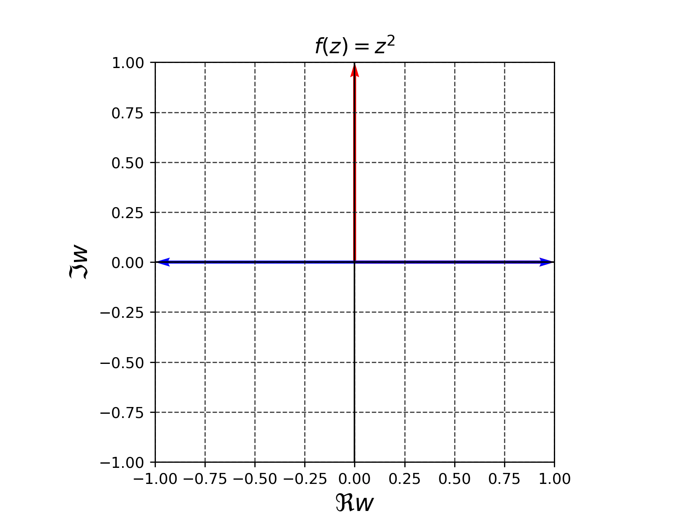
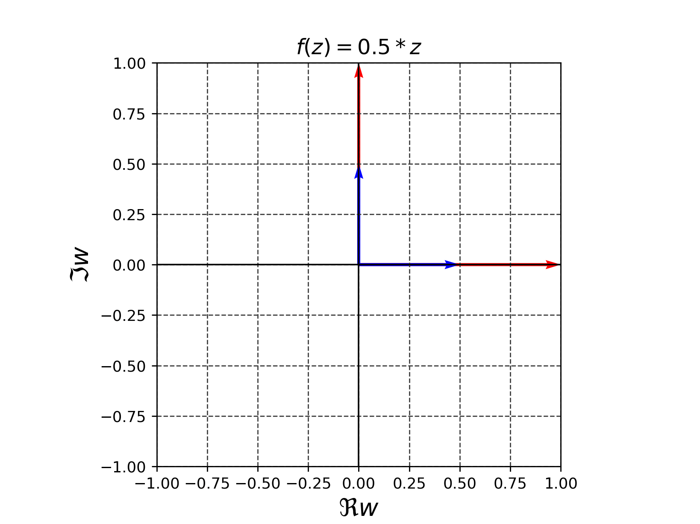
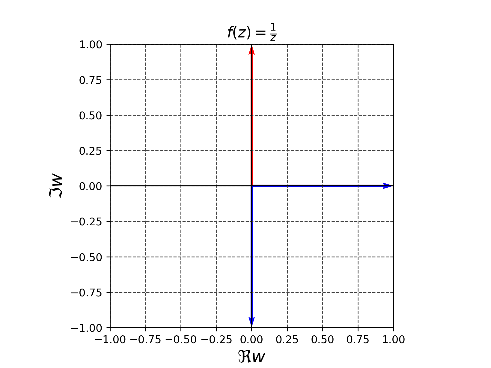

(a)では一次分数関数変換は共形的であると述べた。一次分数変換
```math
\varphi(z)=\frac{az+b}{cz+d}
```
を複素関数とみなすと、これは正則関数である。それでは、それ以外の正則関数、例えば$`\varphi(z)=z^2`$や$`\varphi(z)=e^z`$などはどうであろうか。これらも大体は共形的である。

定理 $`D\subset \mathbb{C}`$を開集合とし、$`\varphi(z)`$を$`\varphi(z)`$を$`D`$上の正則関数とする。
$`\varphi^{\prime}`$が決して0にならないとする。このとき、$`\varphi`$を$`\varphi:D\rightarrow \mathbb{C}`$とみなすと、これは共形的である。


$`D=\mathbb{C}, \varphi(z)=z^2`$とする。$`\varphi`$で実軸の正の部分$`l`$は実軸の正の部分に、虚軸の虚数部分が正の部分$`m`$、
実軸の負の部分に写る。$`l`$と$`m`$の$`O`$での確度は90度だったが、$`\varphi(l)`$と$`\varphi(m)`$の確度は180度であり、一致しない。
これは、$`O`$での$`\varphi`$の微分が0になるためである。


👆️$`z^2`$は原点$`O=(0,0)`$で共形的ではない。



👆️スカラー倍は共形写像である



👆️$`1/z`$は共形写像である