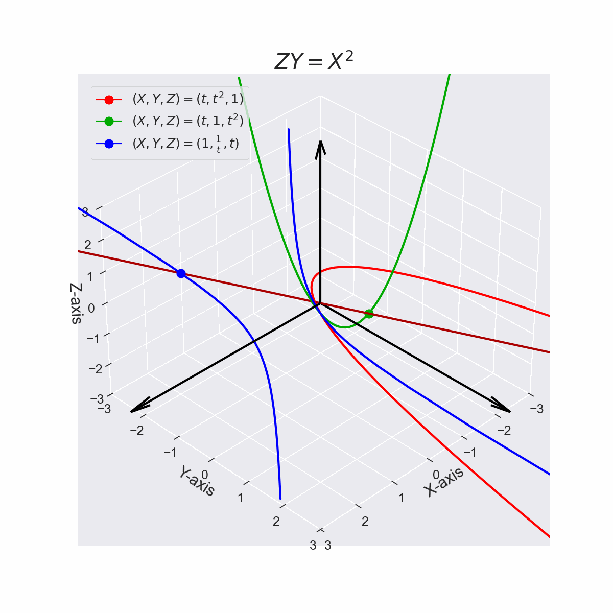

# 2次元実射影空間上$`P(\mathbb{R})`$の曲線
2次元の実空間$`\mathbb{R}^{2}=\{(x,y) | x,y \in \mathbb{R} \}`$上の放物線は以下の式で定義される。
```math
y=x^2 \cdots (1)
```
$`x=\frac{X}{Z}`$、$`y=\frac{Y}{Z}`$と変数変換すると、
```math
\left(\frac{Y}{Z}\right)=\left(\frac{X}{Z}\right)^{2}=\frac{X^2}{Z^2} \cdots (2)
```
```math
\therefore ZY=X^2 \cdots (3)
```

となり$`y=x^2`$は$`ZY=X^2`$として3次元の実空間$`\mathbb{R}^{3}=\{(X,Y,Z) | X,Y,Z \in \mathbb{R} \}`$に埋め込むことができる。


*Fig. 1 $`ZY=X^2`$を平面$`Z=1`$, 平面$`Y=1`$, 平面$`X=1`$に射影した結果*


- 参考文献[1] 基礎数学5 多様体の基礎 松本幸夫 東京大学出版会 2011年 第23刷 ,pp. 128-130
- 参考文献[2] 平面代数曲線のはなし 今野一宏 内田老鶴圃 2017年 第1版, pp. 5-7

