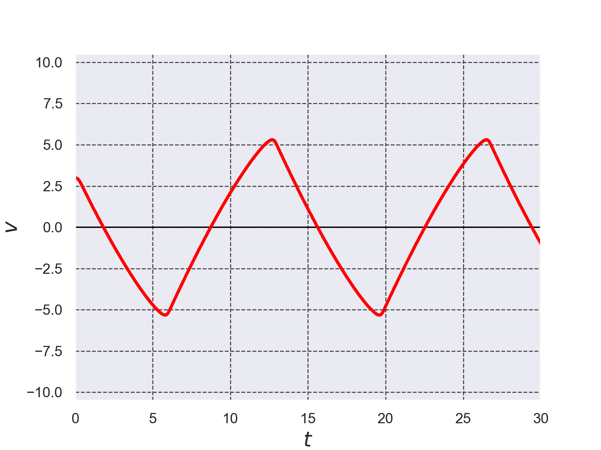
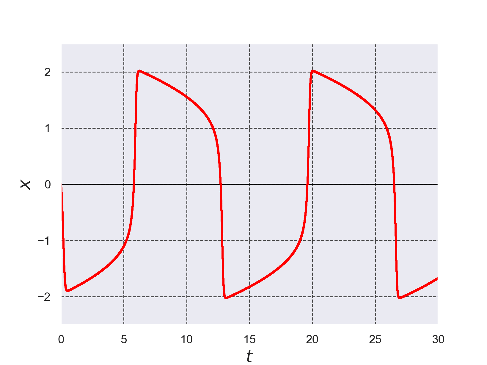
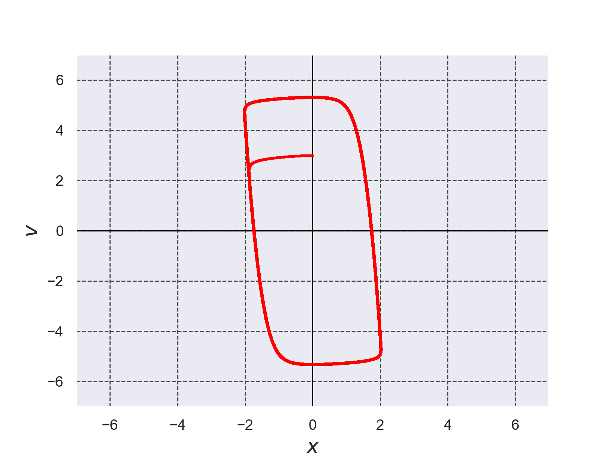

# 弛緩振動を表す微分方程式をルンゲ・クッタ法で解いた結果のプロット

+ 弛緩振動を表す微分方程式を以下に示す。この方程式は参考文献[1]の2階微分方程式を一階連立微分方程式に書き換えたものである。
```math
\frac{d x}{d t} = v \cdots (1)
```
```math
\frac{d v}{d t} = -x+\varepsilon v -\frac{\varepsilon v^3}{3} \cdots (2)
```

+ ルンゲ・クッタ法のコードは[./runge_kutta_relaxation_vib.c](./runge_kutta_relaxation_vib.c)である。ルンゲ・クッタ法は参考文献[2]を参考に実装した。


*Fig.1 弛緩振動のプロット$`v(t)`$*


*Fig.2 弛緩振動のプロット$`x(t)`$*


*Fig.3 弛緩振動を位相平面上でのプロット$`(x(t),v(t))`$*


- 参考文献[1] 機械振動学通論 第3版 入江敏博・小林幸徳 朝倉書店 2006年 初版第1刷, pp.161-165
- 参考文献[2] C言語による数値計算入門 第2版 新装版 堀之内 總一・酒井幸吉・榎園茂 森北出版株式会社 2015年 第2版装版第1刷発行, pp.128-129
