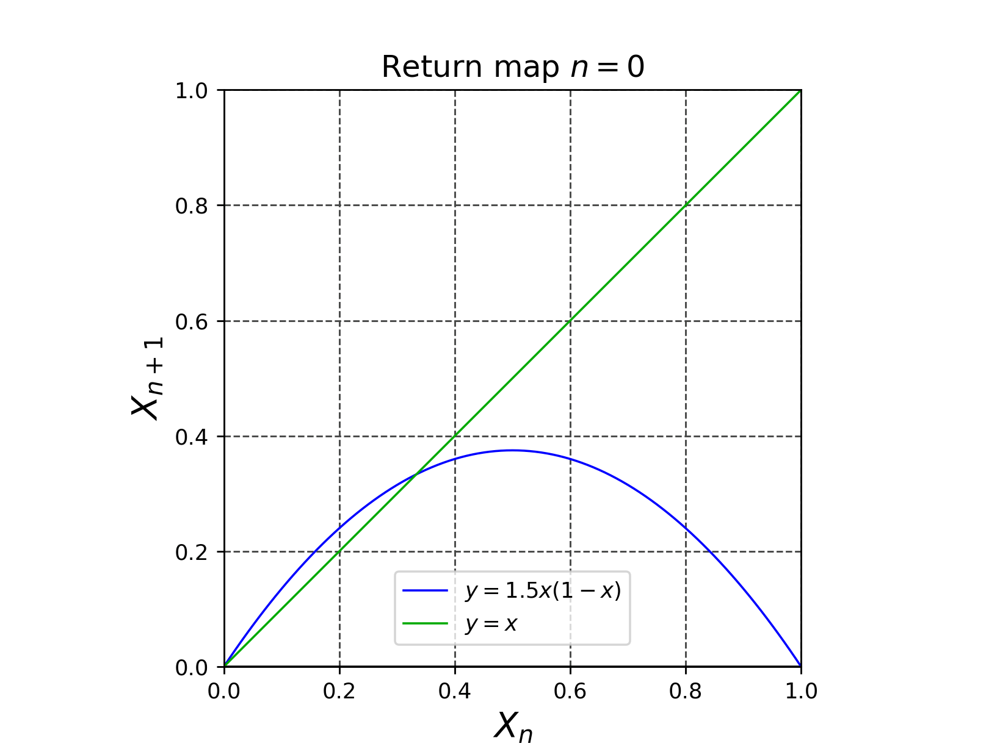
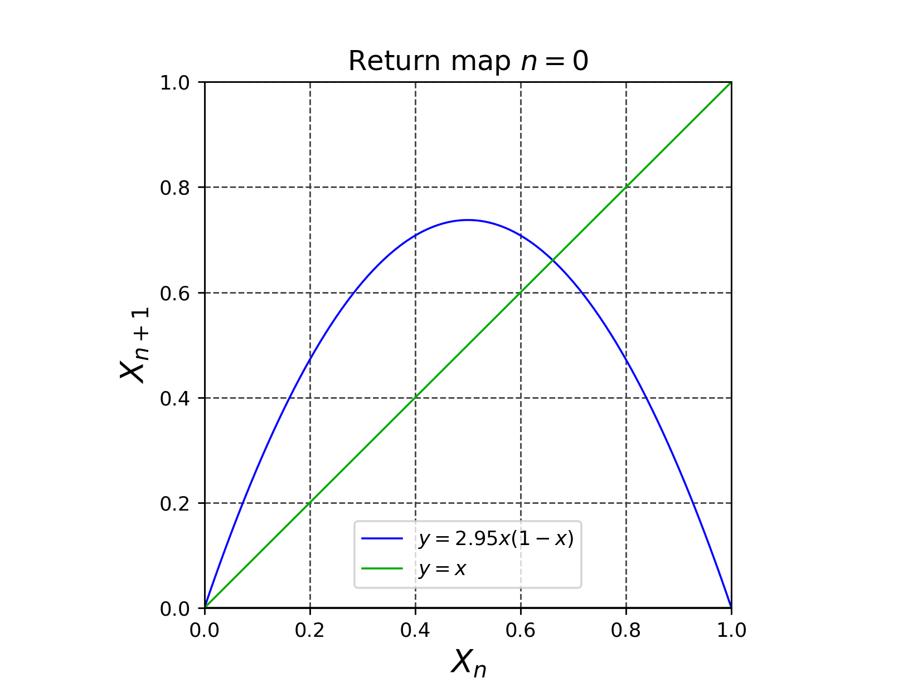
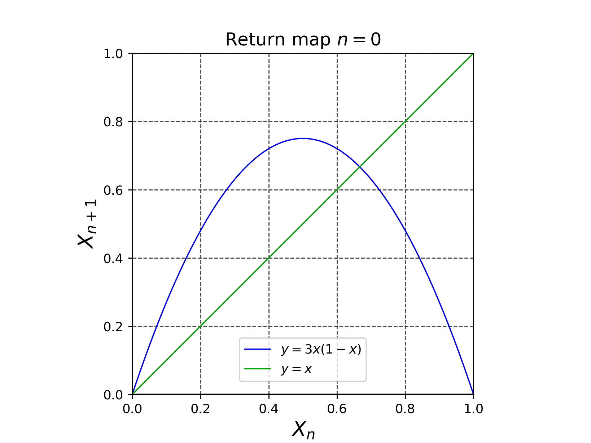
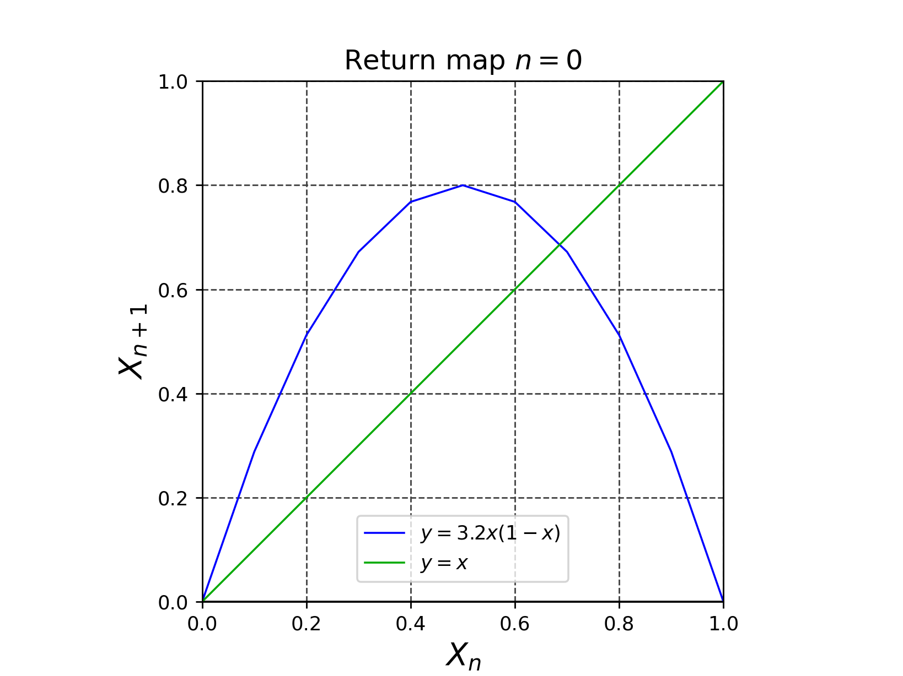
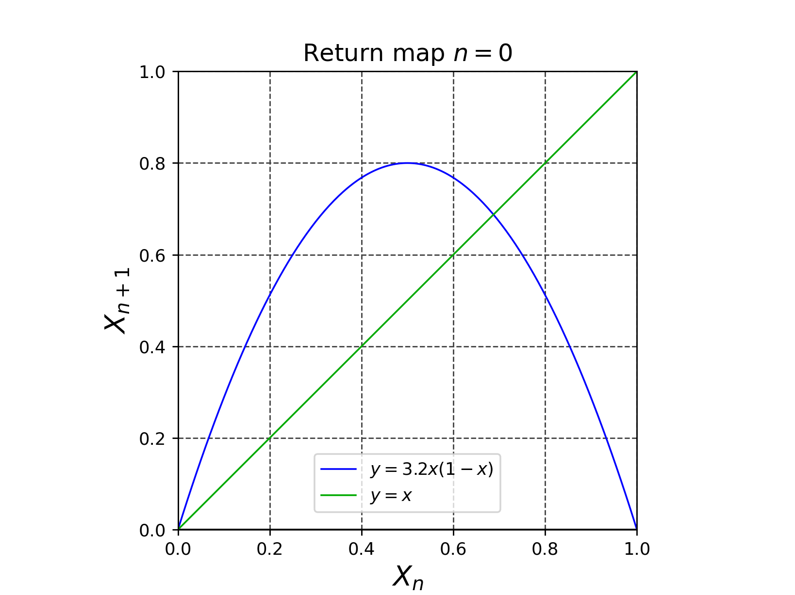
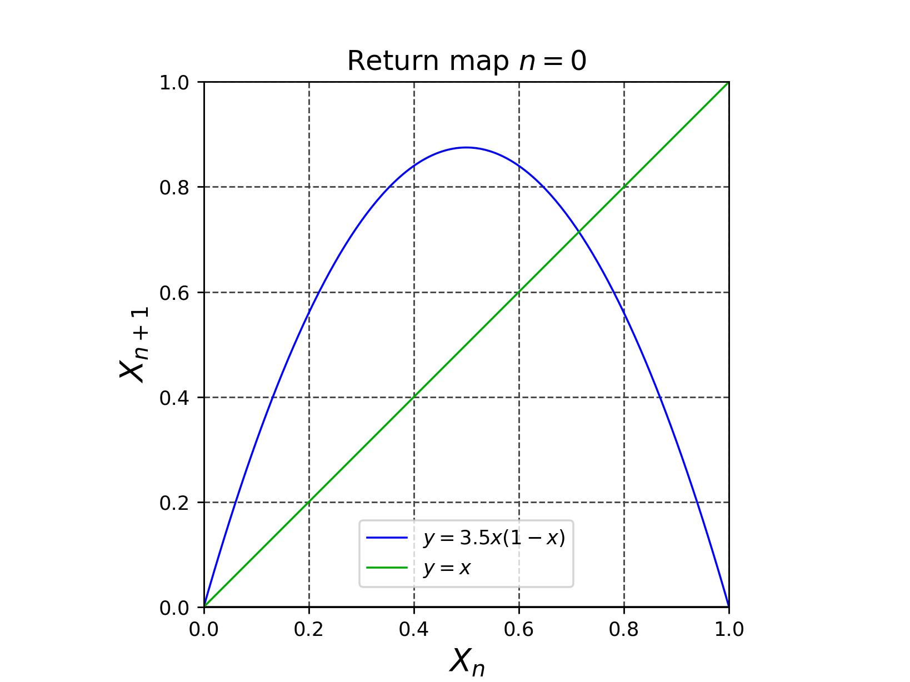
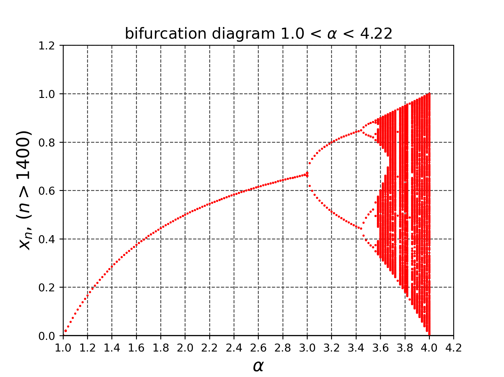

# draw_logistic_map
- ロジスティック写像$`x_{n+1} = \alpha x_n(1-x_n)`$の不動点の安定性をリターンマップを使って観察してみよう。

> [!NOTE]
> ```math
> f(x) = \alpha x(1-x)
> ```
> とする。このとき、
> ```math
> A=f(A)
> ```
> を満たす点$`A`$をロジスティック写像の不動点とよぶ。
> 初期値を$`x_{0}=A+\epsilon`$としたときに
> ```math
> \lim_{n \to \infty} x_{n}
> ```
> がどのような挙動をしめすか解析することを**不動点の安定性解析**とよぶ。


## ロジスティック写像$`x_{n+1} = \alpha x_n(1-x_n)`$のリターンマップのアニメーション
- $\alpha=1.5$の時は、安定不動点に収束する。

- $\alpha=2.8$の時は、安定不動点に収束する。

- $\alpha=2.95$の時は、ゆっくりと安定不動点に収束する。($\alpha=3$ が唯一の解と周期が2の解との分岐点)

- $\alpha=3$の時は、ゆっくりと周期的な値(周期=2)になっているように見える。

- $\alpha=3.2$の時は、周期的な値(周期=2)になる。


> [!IMPORTANT]
> さらに$`\alpha=3.2`$の時は、不動点が**不安定化**する。
> 


- $\alpha=3.5$の時は、周期的な値(周期=4)になる。

- $\alpha=4$の時は、カオスになる。


## ロジスティック写像の分岐図


- 参考文献 改定増補 カオス力学の基礎 早間 慧 現代数学社 2002年 改訂第2版, p.5, pp.21-22
