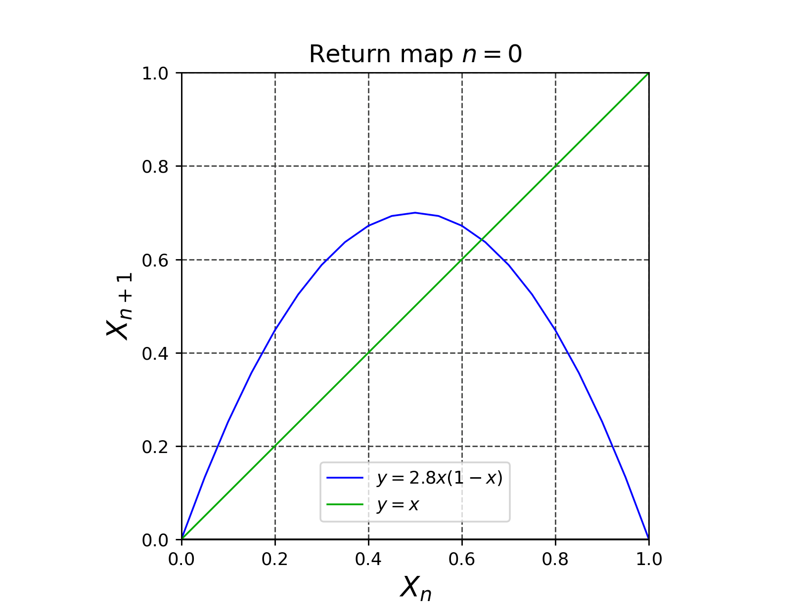
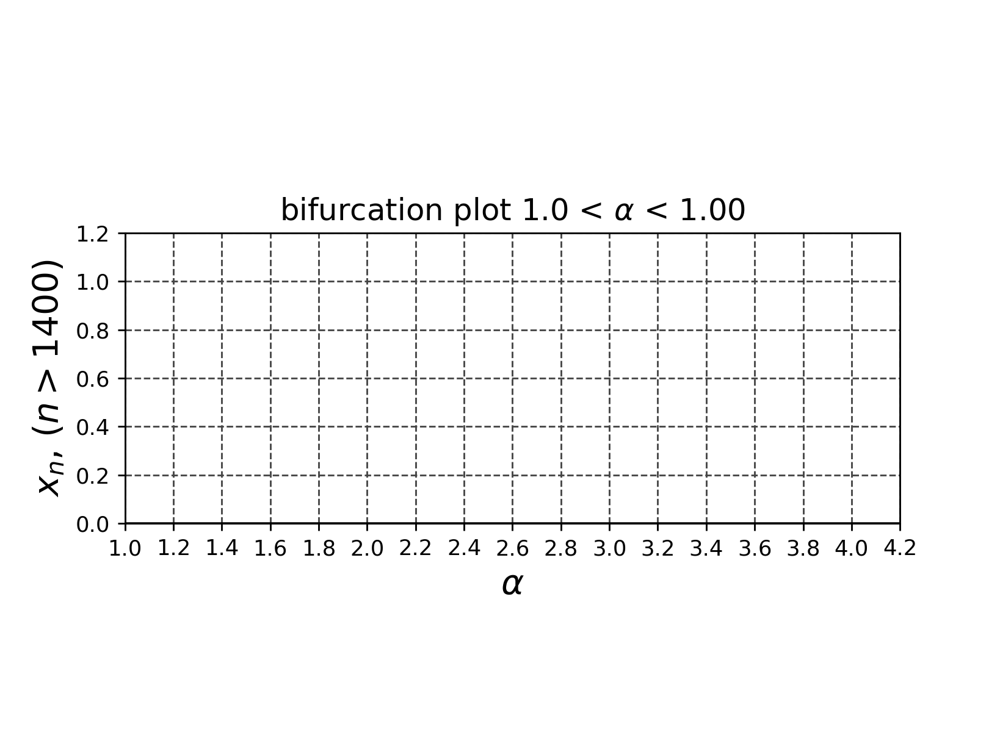

# draw_logistic_map
## ロジスティック写像$`x_{n+1} = \alpha x_n(1-x_n)`$のリターンマップのアニメーション
- $\alpha=2.8$の時は、安定不動点に収束する。

- $\alpha=4$の時は、カオスになる。

## ロジスティック写像の分岐図

- 参考文献 改定増補 カオス力学の基礎 早間 慧 現代数学社 2002年 改訂第2版, p.5, pp.21-22
