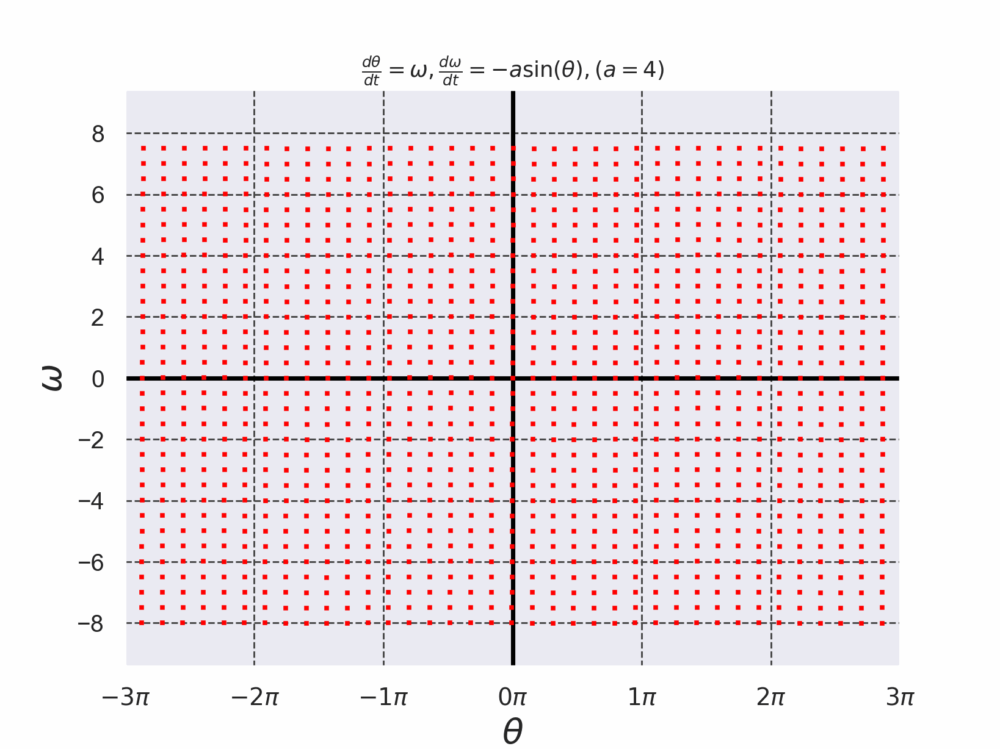
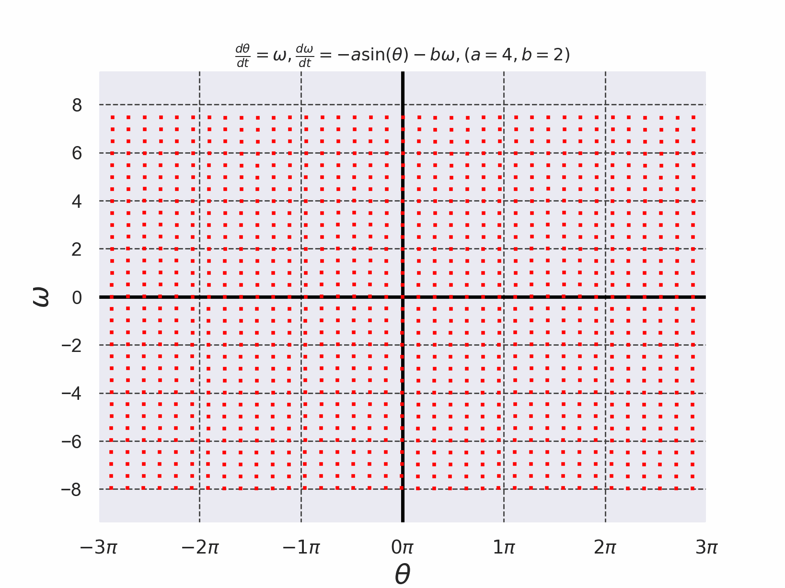

# 単振り子の方程式を4次のルンゲ・クッタ法で解いた結果

+ 単振り子の方程式を$`(1)`$,$`(2)`$で定義する。
+ 微分方程式を解く際に使用したルンゲ・クッタ法のコードは[./runge_kutta_pendulum_eq.c](./runge_kutta_pendulum_eq.c)である。 (このコードは参考文献[2]のコードを参考に実装した)。

```math
\frac{d\theta}{dt}=\omega \cdots (1)
```

```math
\frac{d\omega}{dt}=-a\sin(\theta) \cdots (2)
```


*Fig. 1 単振り子の方程式を4次のルンゲ・クッタ法で解いた結果のアニメーション*

+ 摩擦のある単振り子の方程式を$`(3)`$,$`(4)`$で定義する。
+ 微分方程式を解く際に使用したルンゲ・クッタ法のコードは[./runge_kutta_pendulum_eq_dissipative.c](./runge_kutta_pendulum_eq_dissipative.c)である。 (このコードは参考文献[2]のコードを参考に実装した)。

```math
\frac{d\theta}{dt}=\omega \cdots (3)
```

```math
\frac{d\omega}{dt}=-a\sin(\theta)-b\omega \cdots (4)
```


*Fig. 2 摩擦のある単振り子の方程式をを4次のルンゲ・クッタ法で解いた結果のアニメーション。不動点$`(\theta,\omega)=(-2\pi,0)=(0,0)=(2\pi,0)\cdots`$に軌道が吸引されていることがわかる*

- 参考文献[1] 常微分方程式 基礎から応用へ 新装版 俣野博 岩波書店 2026年 新装版第1刷発行, pp. 30-33
- 参考文献[2] C言語による数値計算入門 第2版 新装版 堀之内 總一・酒井幸吉・榎園茂 森北出版株式会社 2015年 第2版装版第1刷発行, pp.128-129

