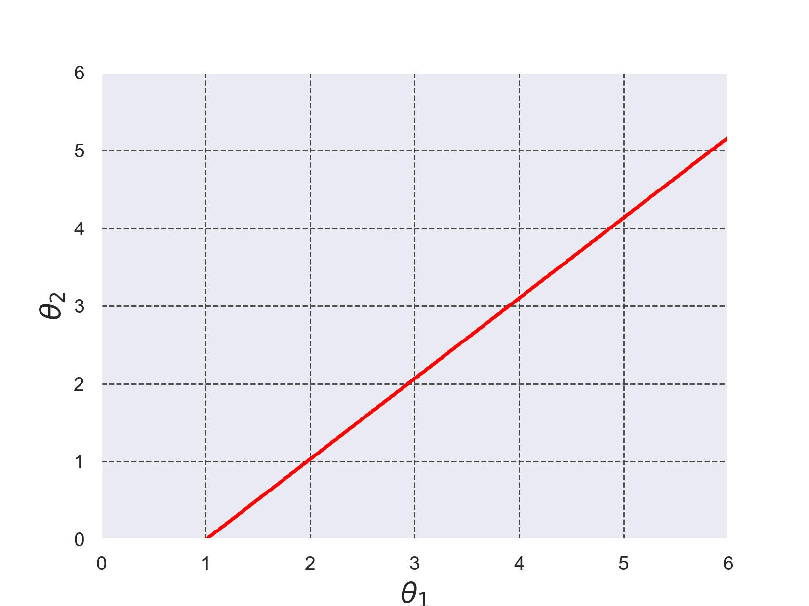

# 同期現象(蔵元モデル)を4次のルンゲ・クッタ法で解いた結果の3Dプロット
+ 下記の同期現象(蔵元モデル)微分方程式を4次のルンゲ・クッタ法で解き、その結果をプロットした。初期条件は$`\theta_{1}(0)=2.3, \theta_{2}(0)=0.0, \omega = \frac{1}{2}`$とした。この初期条件は参考文献[1]のp.119のグラフの値を参考に設定した。

+ 微分方程式を解く際に使用したルンゲ・クッタ法のコードは[./runge_kutta_sync_phenom.c](./runge_kutta_sync_phenom.c)である。 (このコードは参考文献[2]のコードを参考に実装した)。
```math
\frac{d \theta_1}{d t} = \omega + \varepsilon \sin(\theta_2 - \theta_1) \cdots (1)
```
```math
\frac{d \theta_2}{d t} = \omega + \varepsilon \sin(\theta_1 - \theta_2) \cdots (2)
```



*Fig.1 同期現象(蔵元モデル)、初期条件は$`\theta_{1}(0)=2.3, \theta_{2}(0)=0.0, \omega = \frac{1}{2}`$である。$`t \rightarrow \infty `$のときに$`\theta_{1}(t)=\theta_{2}(t)`$となっていることが確認できる。これは同期現象とよばれる。*


- 参考文献[1] 解くための微分方程式と力学系理論 千葉逸人 現代数学社 2021年 初版第2刷発行, pp.118-119
- 参考文献[2] C言語による数値計算入門 第2版 新装版 堀之内 總一・酒井幸吉・榎園茂 森北出版株式会社 2015年 第2版装版第1刷発行, pp.128-129

