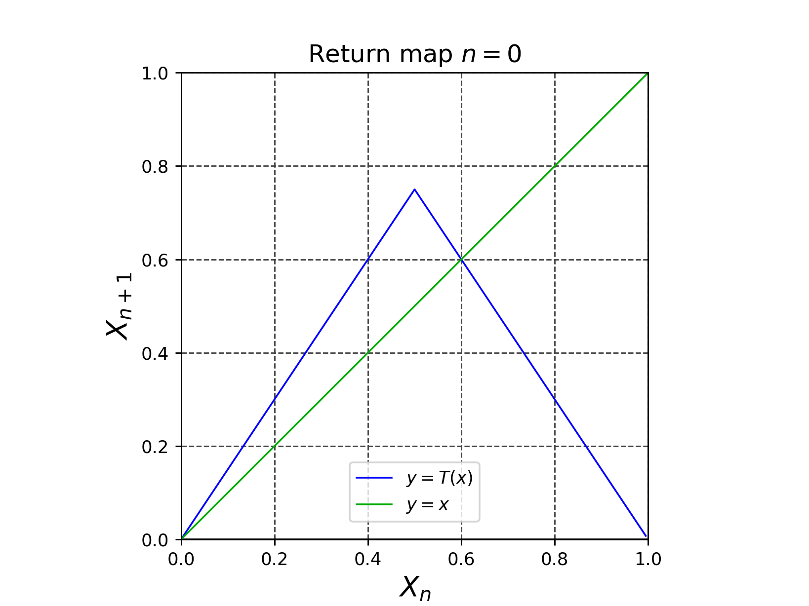
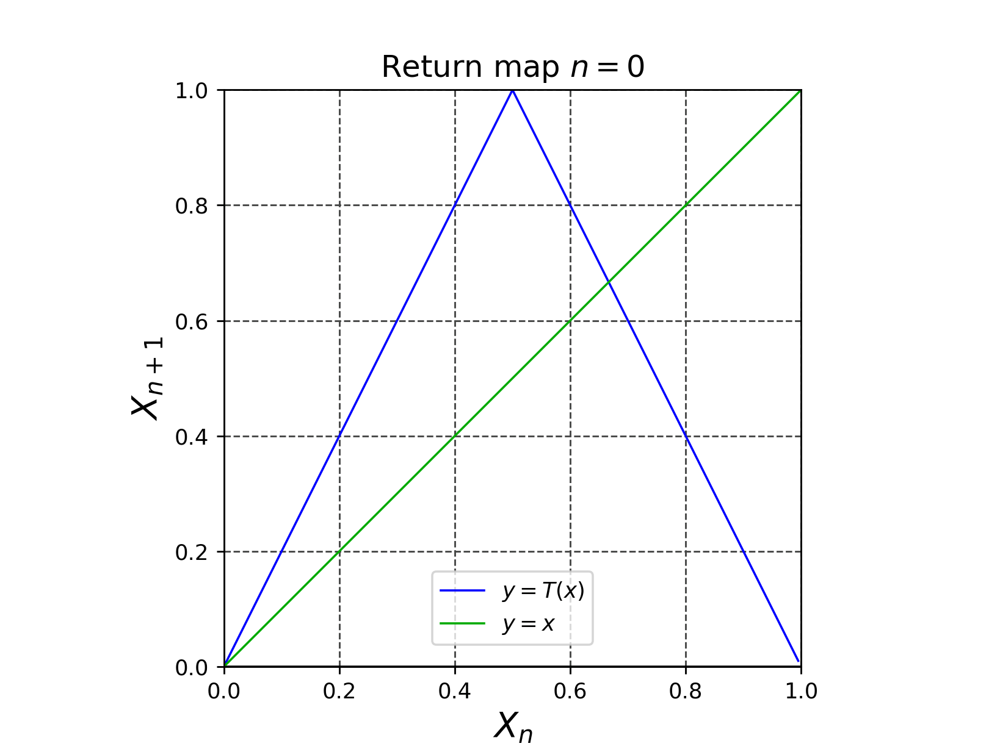
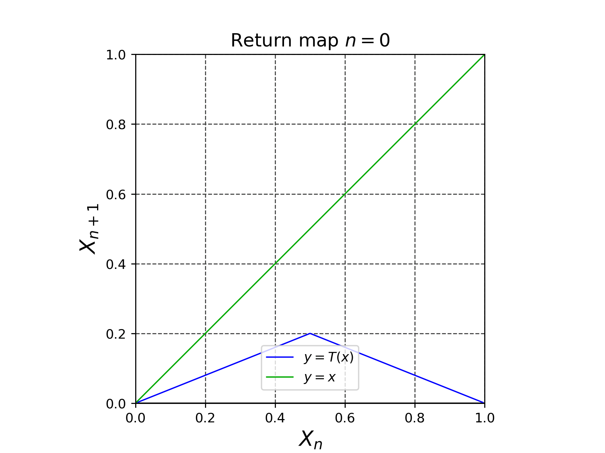

# テント写像のリターンマップ

*Fig. 1 カオスになる場合*

*Fig. 2 周期解になる場合*

*Fig. 3 収束する場合*

- 参考文献 力学系入門 原著第3版 微分方程式からカオスまで Morris W.Hirsch , Stephen Smale , Robert L.Devaney , 桐木 紳 訳, 三波 篤郎 訳, 谷川 清隆 訳, 辻井 正人 訳 共立出版 2017年 原著第3版第1刷, p. 349
- 参考文献 改定増補 カオス力学の基礎 早間 慧 現代数学社 2002年 改訂第2版, p. 5, pp. 21-22

