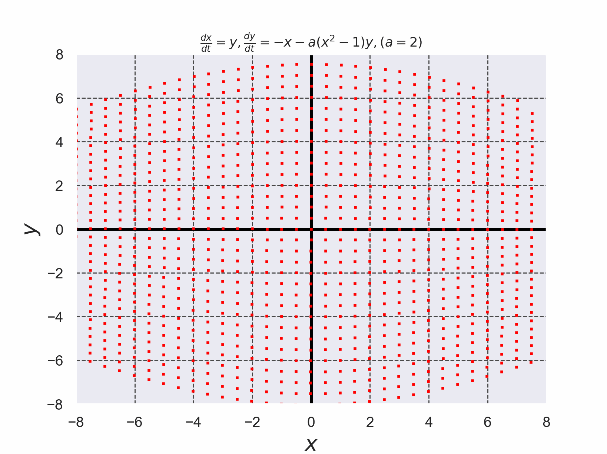

# van der Pol方程式を4次のルンゲ・クッタ法で解いた結果

+ van der Pol方程式を$`(1)`$,$`(2)`$で定義する。
+ 微分方程式を解く際に使用したルンゲ・クッタ法のコードは[./runge_kutta_van_der_pol_eq.c](./runge_kutta_van_der_pol_eq.c)である。 (このコードは参考文献[2]のコードを参考に実装した)。

```math
\frac{dx}{dt}=y \cdots (1)
```

```math
\frac{dy}{dt}=x-a(x^2-1)y \cdots (2)
```


*Fig. 1 原点$`(x_0,y_0)=(0,0)`$以外の全ての初期値$`(x_0,y_0)`$から出発した解がリミットサイクルに近づいている様子がわかる*


- 参考文献[1] 常微分方程式 基礎から応用へ 新装版 俣野博 岩波書店 2026年 新装版第1刷発行, pp. 130-131
- 参考文献[2] C言語による数値計算入門 第2版 新装版 堀之内 總一・酒井幸吉・榎園茂 森北出版株式会社 2015年 第2版装版第1刷発行, pp.128-129

