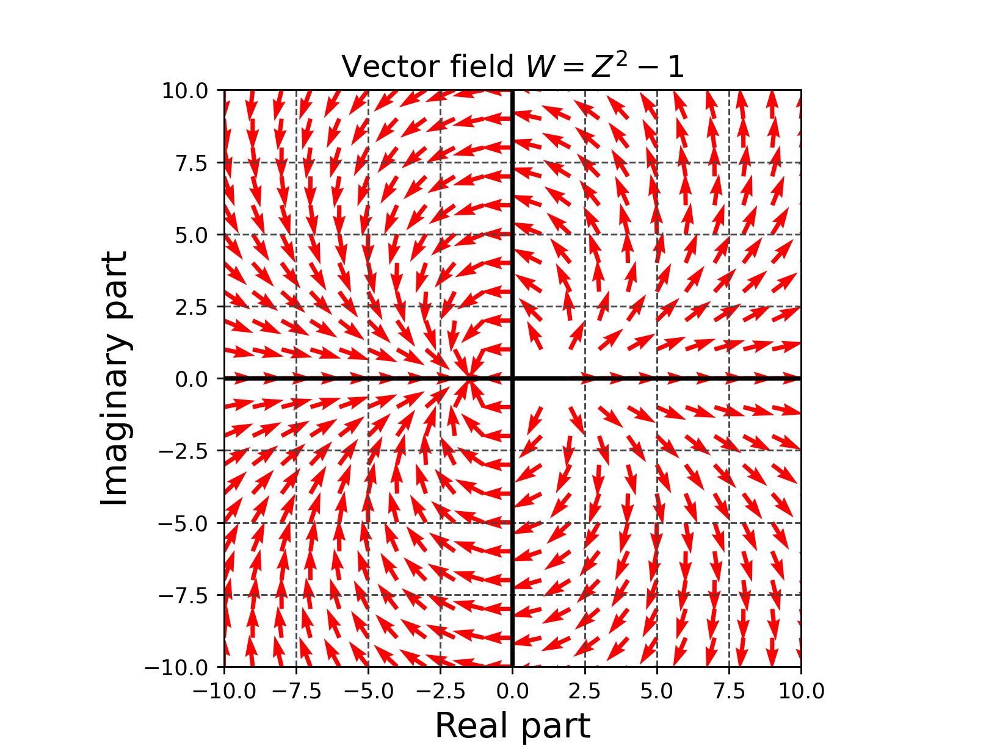
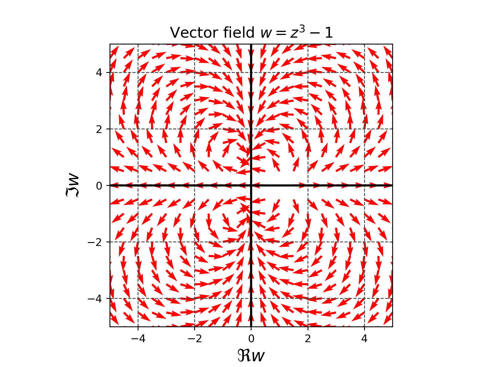

# 複素関数を使って2次元ベクトル場を作成

*Fig. 1 $`w=z^2-1`$のベクトル場 ($`z=x+iy`$を代入して$`w`$を求め、各$`(x,y)`$に$`w`$をベクトルとみなしてプロットした結果)*

Fig. 1は[./draw_vector_field.py](./draw_vector_field.py)のコードで作成した。

*Fig. 2 $`w=z^3-1`$のベクトル場 ($`z=x+iy`$を代入して$`w`$を求め、各$`(x,y)`$に$`w`$をベクトルとみなしてプロットした結果)*

Fig. 2は[./draw_vector_field2.py](./draw_vector_field2.py)のコードで作成した。

- 参考文献[1] 方程式と対称性 山下純一 現代数学社 2021年 初版 ,pp. 228-229, pp. 234-235

